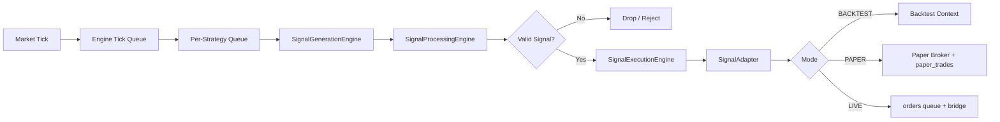
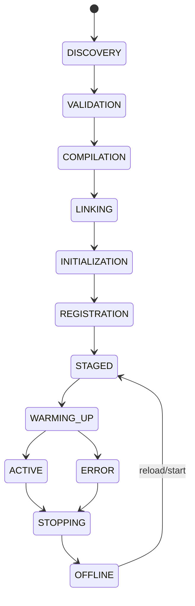

# CoreX System Reference

## 1. Purpose
This document is the backend/system source-of-truth for CoreX.  
It covers runtime architecture, component lifecycle, strategy orchestration, signal flow, persistence, operations, and troubleshooting.

Logging interpretation reference:
- `docs/LOGGING_REFERENCE.md`

## 2. High-Level Runtime Architecture

### 2.1 Main Execution Path
1. Market feed produces ticks (`broker/twelvedata.js`).
2. Tick is published on bus `EVENTS.MARKET.TICK`.
3. Engine (`engine/core/engine.js`) enqueues per-symbol ticks.
4. Engine fans out ticks to subscribed strategies with per-strategy queues.
5. Signal pipeline executes:
   - `SignalGenerationEngine` -> strategy signal call
   - `SignalProcessingEngine` -> normalize/validate
   - `SignalExecutionEngine` -> bounded async execution queue
6. Adapter (`engine/signalAdapter.js`) routes to `BACKTEST|PAPER|LIVE`.
7. Orders/trades/events are persisted and broadcast via WebSocket broadcaster.

### 2.2 Dynamic Strategy Loading
`engine/strategyLoader.js` (StrategyBootloader) boot phases:
1. `DISCOVERY`
2. `VALIDATION`
3. `COMPILATION`
4. `LINKING`
5. `INITIALIZATION`
6. `REGISTRATION`

Strategies can be created/updated/reloaded and started/stopped without process restart.

### 2.3 Runtime Diagrams (Mermaid)

#### Signal Pipeline Lifecycle


#### Strategy Loader Boot Lifecycle


## 3. Core Components

### 3.1 Engine
- File: `engine/core/engine.js`
- Responsibilities:
  - Tick ingestion and queue-based backpressure
  - Strategy subscription routing
  - Warmup/historical sync
  - Signal pipeline + execution context wiring
  - Feed metrics and lifecycle status snapshots

### 3.2 Loader
- File: `engine/strategyLoader.js`
- Responsibilities:
  - Boot strategies from DB source
  - Compile + standardize strategy interfaces
  - Runtime parameter/mode sync from DB
  - Start/stop/reload orchestration

### 3.3 Compiler
- File: `engine/services/strategyCompiler.js`
- Responsibilities:
  - Compile source string to strategy instance
  - Normalize legacy strategy shape
  - Validate required fields/methods
  - Contract adaptation via `StrategyContract.adapt`

### 3.4 Strategy Contract
- File: `engine/core/strategy/StrategyContract.js`
- Required behavior:
  - `generateSignal(packet, context)` (required by contract)
- Optional:
  - `init`, `onMarketData`, `teardown`, `getStateSnapshot`
- Legacy hooks (`onTick`, `onBar`, `next`) are adapted to contract at runtime.

### 3.5 Signal Adapter
- File: `engine/signalAdapter.js`
- Responsibilities:
  - Validate and normalize incoming strategy signals
  - Resolve mode (`runtime_mode` in DB when available)
  - Lock per `strategyId_symbol` to prevent concurrent duplicate execution
  - Execute in `BACKTEST`, `PAPER`, `LIVE`
  - Emit failures on system bus and expose adapter metrics

### 3.6 Lifecycle Standardization
- File: `engine/core/lifecycle/ComponentLifecycle.js`
- States:
  - `CREATED`, `INITIALIZING`, `READY`, `RUNNING`, `STOPPING`, `STOPPED`, `ERROR`
- Used by engine and loader to provide consistent state snapshots/log structure.

### 3.7 Broadcast/Telemetry
- File: `engine/services/broadcaster.js`
- Pushes periodic:
  - `STATUS_UPDATE`
  - `FEED_METRICS`
  - `MT5_BRIDGE_STATUS`
- Strategy list source: `loader.listStrategies()`.

## 4. REST API Domains

### 4.1 Strategy Management
- File: `engine/routes/strategyController.js`
- Key endpoints:
  - `GET /api/strategies`
  - `GET /api/strategies/:id`
  - `POST /api/strategies`
  - `PUT /api/strategies/:id`
  - `PATCH /api/strategies/:id/rename`
  - `DELETE /api/strategies/:id`

### 4.2 Execution
- File: `engine/routes/executionController.js`
- Key endpoints:
  - `GET /api/execution/status`
  - `GET /api/execution/telemetry/:id`
  - `POST /api/execution/start/:id`
  - `POST /api/execution/stop/:id`
  - `PATCH /api/execution/params/:id`

### 4.3 System/Settings/Account
- File: `engine/routes/systemController.js`
- Key endpoints:
  - `GET /api/system/heartbeat`
  - `GET /api/system/feed/metrics`
  - `GET /api/system/settings`
  - `PATCH /api/system/settings`
  - `GET /api/system/run/settings`
  - `PATCH /api/system/run/settings`
  - account and MT5 bridge status endpoints

### 4.4 Endpoint-by-Endpoint Examples

#### 4.4.1 Start strategy
Request:
```bash
curl -X POST http://localhost:3000/api/execution/start/ema_crossover \
  -H "Content-Type: application/json" \
  -d '{
    "mode":"PAPER",
    "timeframe":"15m",
    "params":{"fastPeriod":12,"slowPeriod":26}
  }'
```
Response:
```json
{
  "success": true,
  "message": "Deployment initiated for ema_crossover. Engine handover in progress..."
}
```

#### 4.4.2 Stop strategy
Request:
```bash
curl -X POST http://localhost:3000/api/execution/stop/ema_crossover
```
Response:
```json
{
  "success": true,
  "message": "Stop signal processed for ema_crossover. Connections closing."
}
```

#### 4.4.3 Hot-update runtime params
Request:
```bash
curl -X PATCH http://localhost:3000/api/execution/params/ema_crossover \
  -H "Content-Type: application/json" \
  -d '{"params":{"fastPeriod":10,"slowPeriod":40}}'
```
Response:
```json
{
  "success": true,
  "message": "Parameters hot-swapped and persisted."
}
```

#### 4.4.4 Read system heartbeat
Request:
```bash
curl http://localhost:3000/api/system/heartbeat
```
Response shape:
```json
{
  "success": true,
  "payload": {
    "status": "OPERATIONAL",
    "uptime": "2h 14m",
    "resources": { "cpuPct": "12.2", "ramPct": "37.1" },
    "connectivity": { "marketData": "CONNECTED", "bridge": "CONNECTED", "latency": 123 }
  }
}
```

#### 4.4.5 Update system settings
Request:
```bash
curl -X PATCH http://localhost:3000/api/system/settings \
  -H "Content-Type: application/json" \
  -d '{
    "settings":{
      "tickQueueMax":8000,
      "tickFlushMax":4000,
      "ui":{"theme":"corex-dark"}
    },
    "persist":true
  }'
```
Response shape:
```json
{
  "success": true,
  "payload": {
    "tickQueueMax": 8000,
    "tickFlushMax": 4000
  }
}
```

#### 4.4.6 Paper account balance
Request:
```bash
curl http://localhost:3000/api/system/account/paper/balance
```
Response shape:
```json
{
  "success": true,
  "payload": {
    "mode": "PAPER",
    "cash": 10000,
    "equity": 10000,
    "positions": []
  }
}
```

#### 4.4.7 Update paper account settings
Request:
```bash
curl -X PATCH http://localhost:3000/api/system/account/paper/settings \
  -H "Content-Type: application/json" \
  -d '{
    "cash":12000,
    "config":{"commissionPerShare":0.001,"slippageBps":3}
  }'
```
Response shape:
```json
{
  "success": true,
  "payload": {
    "cash": 12000,
    "config": { "commissionPerShare": 0.001, "slippageBps": 3 }
  }
}
```

#### 4.4.8 Live account balance
Request:
```bash
curl http://localhost:3000/api/system/account/live/balance
```
Response shape:
```json
{
  "success": true,
  "payload": {
    "mode": "LIVE",
    "balance": 10234.77,
    "equity": 10190.12,
    "positions": [],
    "bridge": { "connected": true, "authorized": true }
  }
}
```

#### 4.4.9 Run-mode settings
Request:
```bash
curl http://localhost:3000/api/system/run/settings
```
Response shape:
```json
{
  "success": true,
  "payload": {
    "modes": ["PAPER","LIVE"],
    "defaultMode": "PAPER",
    "timeframes": ["1m","5m","15m","1h"],
    "bridgeProviders": ["python_receiver","mql5_receiver","metaapi"],
    "activeBridgeProvider": "python_receiver"
  }
}
```

## 5. Persistence Model

### 5.1 Existing Runtime Tables
- `strategies`: source + runtime mode/params
- `orders`, `paper_trades`
- `system_settings`, `broker_settings`
- auth/account tables via `pgStore`

### 5.2 HFT Additions
- Migration: `db/migrations/20260221_hft_pipeline_optimizations.sql`
- Added:
  - `strategy_signals`
  - `strategy_ticks` (range-partitioned by timestamp)
  - `execution_events`

## 6. Runtime Config + Connectivity

### 6.1 Runtime Loader
- File: `engine/services/integrationRuntime.js`
- Reads persisted settings and applies runtime values for:
  - TwelveData
  - MetaApi
  - MT5 Bridge

### 6.2 Config Refresh Path
1. `PATCH /api/system/settings` or `/api/system/run/settings`
2. `configService.refresh()`
3. `integrationRuntime.refresh()`
4. `EVENTS.SYSTEM.CONFIG_REFRESH` emitted

### 6.3 Broker Account Clarity (Paper and Live)
- Core principle: strategy logic is mode-agnostic, account controls are mode-explicit.
- `PAPER`:
  - account state comes from paper broker store
  - uses `paper_trades` persistence path
  - best for simulation and tuning
- `LIVE`:
  - account state comes from MT5 bridge snapshots
  - uses `orders` + bridge execution path
  - best for production execution
- Recommended operator checks:
  1. verify `/api/system/account/:mode/balance`
  2. verify `/api/system/account/:mode/settings`
  3. verify `/api/system/run/settings` default mode/provider
  4. verify `/api/system/mt5/status` before live activation

## 7. Reliability / Throughput Controls
- Tick queues: symbol-level and strategy-level queueing
- Bounded execution queue in `SignalExecutionEngine`
- Queue overflow protection (drop counters + metrics)
- Warmup cache sanitization + clamp maintenance

## 8. Operations

### 8.1 Core commands
- Start: `npm start`
- Dev: `npm run dev`
- Run tests: `npm test -- --runInBand`
- DB migrate: `npm run db:migrate`
- Cleanup dry-run: `npm run maintenance:prune`
- Cleanup apply: `npm run maintenance:prune:apply`

### 8.2 Maintenance Script
- File: `scripts/maintenance/prune-runtime-artifacts.js`
- Prunes stale runtime artifacts (dry-run by default)
- Optional DB `VACUUM ANALYZE` for key tables when `--apply`

## 9. Testing Coverage
Current backend tests include:
- `test/auth.service.test.js`
- `test/signalAdapter.test.js`
- `test/pipeline.test.js`
- `test/strategy.contract.compiler.test.js`
- `test/engine.pipeline.integration.test.js`

## 10. Known Runtime States and Meanings
- `OFFLINE`: not registered/running
- `STAGED`: compiled and ready
- `WARMING_UP`: historical preload in progress
- `ACTIVE`: strategy actively processing live ticks
- `STOPPING`: graceful unregister/teardown
- `ERROR`: strategy failed and requires operator action/reload

## 11. Troubleshooting

### 11.1 `loader.listStrategies is not a function`
- Cause: stale/older loader module instance or mismatched deployment.
- Fix:
  1. Verify `engine/strategyLoader.js` exports singleton with `listStrategies()`.
  2. Restart server and confirm broadcaster uses same module alias path.

### 11.2 `WebSocket is closed before the connection is established`
- Common causes:
  - client reconnect race
  - auth/session invalidation
  - server upgrade route mismatch
- Check:
  - server WS upgrade logs
  - client reconnect throttling/backoff
  - auth headers/token on reconnect

### 11.3 `Client network socket disconnected before secure TLS connection was established`
- External feed/network/TLS instability, not strategy logic.
- Validate:
  - outbound network
  - provider host availability
  - TLS/firewall/proxy environment

### 11.4 `engine.stop() failed: Cannot read properties of undefined (reading 'clear')`
- **Cause:** A resource with a `clear()` method (likely a tick or strategy queue) is `undefined` when `engine.stop()` is called. This is often due to incorrect shutdown order, where a dependency (like a broker) prematurely cleans up a resource the engine still needs.
- **Fix:**
  1. **(Defensive)** Add null-checks in `engine.stop()` before calling `.clear()` on any queue.
  2. **(Corrective)** Refactor shutdown logic to ensure components only clean up their own resources. The `engine` should manage its queues' lifecycle, and other components should not have the ability to destroy them.
  3. Check for inconsistent module `require` paths, which can lead to state corruption between components.
