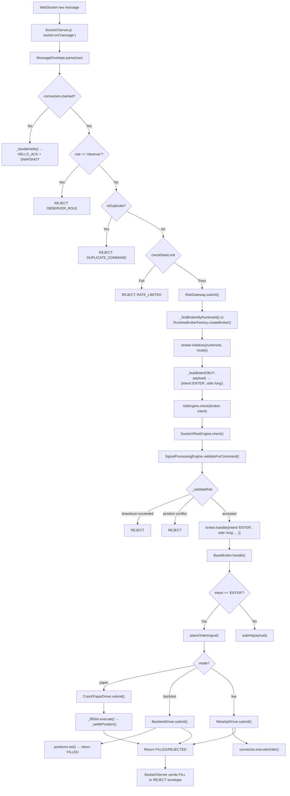

# CoreX Architecture Audit

> **Date:** 2026-08-30
> **Scope:** Read-only verification of actual code state vs. `plans/decisions.md` and `plans/to_do.md`.
> **Method:** Actual file reads and grep — not assumptions from docs.

---

## 1. Package Inventory

### corex-accounts
| Field | Value |
|-------|-------|
| package.json name | `corex-accounts` |
| index.js exports | `ConnectionsService`, `CONNECTOR_SCHEMAS`, `BrokerPersistenceService` |
| Tests | 1 file (`test/connections.test.js`) |
| Actual contents | `src/connectionsService.js` — Encrypted connection credential CRUD (connections table, AES-256-GCM via secretsVault, scoped to accountId + connectorType). `src/brokerPersistenceService.js` — Persists broker settings per userId+mode into `user_broker_settings`; listens to `EVENTS.BROKER.STATE_CHANGED`. |

### corex-auth
| Field | Value |
|-------|-------|
| package.json name | `corex-auth` |
| index.js exports | `AuthService`, `SecretsVault`, plus named exports: `signToken`, `verifyToken`, `hashPassword`, `verifyPassword`, `encryptString`, `decryptString`, `encryptObjectSecrets`, `decryptObjectSecrets`, `maskSecrets`, `rotateObjectSecrets`, `isEncryptedString`, `reloadKeys`, `validateKeyConfig`, `DecryptionError`, `PREFIX`, `DEFAULT_SECRET_PATHS` |
| Tests | 2 files (`test/AuthService.test.js`, `test/SecretsVault.test.js`) |
| Actual contents | `src/AuthService.js` — Pure-logic JWT (HMAC-SHA256) + scrypt password hashing. No Express/Postgres. `src/SecretsVault.js` — Pure-logic AES-256-GCM encryption with key rotation. |

### corex-broker-contract
| Field | Value |
|-------|-------|
| package.json name | `corex-broker-contract` |
| index.js exports | `BrokerContract`, `BaseBroker`, `UnsupportedOperationError`, `BacktestDriver`, `CoreXPaperDriver`, `MetaApiDriver`, `MT5MQL5Connector`, `MetaApiConnector`, `RuntimeBrokerFactory`, `mt5Bridge`, `SharedFillSim`, `SymbolNormalizer`, `DataPaginationLayer`, shape/type exports, plus aliases `BacktestBroker`, `PaperBroker`, `LiveBroker` |
| Tests | 10 files |
| Actual contents | `src/base/BrokerContract.js`, `BaseBroker.js`, `UnsupportedOperationError.js`; `src/drivers/BacktestDriver.js`, `CoreXPaperDriver.js`, `MetaApiDriver.js`; `src/connectors/MetaApiConnector.js`, `MT5MQL5Connector.js`; `src/utils/SharedFillSim.js`, `SymbolNormalizer.js`, `DataPaginationLayer.js`; `src/mt5Bridge.js`; `src/RuntimeBrokerFactory.js`. |

### corex-gateway
| Field | Value |
|-------|-------|
| package.json name | `corex-gateway` |
| index.js exports | `MessageEnvelope`, `REASON_CODES`, `SocketXConnection`, `SocketXServer`, `RiskGateway`, `Account`, `TradingAccountRepository`, `InMemoryAccountRepository`, `generateAccountId`, `generateUlid`, `parseAccountId`, `createAccountRouter` |
| Tests | 3 files (`test/account_socketx.test.js`, `test/socketx.authVerifier.test.js`, `test/socketx.test.js`) |
| Actual contents | `src/socketx/MessageEnvelope.js`, `SocketXConnection.js`, `SocketXServer.js`, `RiskGateway.js`; `src/account/Account.js`, `AccountId.js`, `TradingAccountRepository.js`, `InMemoryAccountRepository.js`; `src/http/accountRoutes.js`. |

### corex-market-data
| Field | Value |
|-------|-------|
| package.json name | `corex-market-data` |
| index.js exports | `DataProviderFactory`, `DataProviderContract`, `validateProviderImplementation`, `DataProviderError`, `DATA_PROVIDER_CONTRACT_VERSION`, `TwelveDataProvider`, `FileDataProvider`, `YahooFinanceProvider`, `fetchGuardedHistory`, `MAX_BARS_LIMIT` |
| Tests | 6 files |
| Actual contents | `src/providers/TwelveDataProvider.js`, `YahooFinanceProvider.js`, `FileDataProvider.js`; `src/legacy/twelvedata.js`; `src/backtestDataResolver.js`; `src/MarketFeed.js`; `src/DataProviderFactory.js`; `src/DataProviderContract.js`. |

---

## 2. Engine Business Logic Inventory

### Real Business Logic (non-shim)

| File | Description |
|------|-------------|
| `engine/server.js` | Express HTTP + WebSocket composition root. |
| `engine/core/engine.js` | Bootstraps DataProviderFactory, StrategyLoader, pipeline engines, Socket_X wiring. |
| `engine/services/brokerPersistence.js` | Event-driven broker settings persistence via pgStore; listens to `EVENTS.BROKER.STATE_CHANGED`. **Parallel to corex-accounts package — see discrepancy #3.** |
| `engine/services/broadcaster.js` | WebSocket broadcast service; CPU/DB status caching; client fan-out. |
| `engine/services/jobWorkerSupervisor.js` | Child-process supervisor with restart/heartbeat. |
| `engine/services/strategyCompiler.js` | Strategy code compilation, security-gated validation (6-phase). |
| `engine/services/jobQueue.js` | Database-backed job queue (UUID, normalization, progress). |
| `engine/services/dataCuller.js` | Periodic data cleanup for cache/storage directories. |
| `engine/services/runtimeService.js` | Strategy runtime start/stop via StrategyLoader. |
| `engine/services/userEngineSettingsService.js` | User engine settings CRUD. |
| `engine/services/tradeHistoryService.js` | Trade history analytics, equity curve, P&L normalization. |
| `engine/services/pgStore.js` | PostgreSQL data access layer (users, accounts, strategies, sessions, settings). |
| `engine/services/healthCheck.js` | System health check with DB/MT5/bridge gates. |
| `engine/services/configService.js` | Configuration service with 60s cache, DB-backed. |
| `engine/services/backtestService.js` | Backtest orchestration wrapping backtestManager. |
| `engine/services/marketStatus.js` | Market connectivity status wrapper. |
| `engine/services/liveOrderDispatcher.js` | Periodic live order reconciliation dispatcher. |
| `engine/services/historicalCache.js` | File-based historical bar cache (CSV) with compression. |
| `engine/services/corex-reg.js` | CLI strategy registration with SHA256 verification. |
| `engine/services/postgres.js` | PostgreSQL connection pool singleton. |
| `engine/services/userScope.js` | Scoped ID generation/parsing (`userId::entityId`). |
| `engine/services/integrationRuntime.js` | Integration runtime env/config loader. |
| `engine/services/hashVerifier.js` | Strategy code hash verification against DB. |
| `engine/backtestManager.js` | Backtest orchestrator (data loading, simulation, analytics). |
| `engine/strategyLoader.js` | Strategy bootloader (discover, validate, compile, start/stop, reload). |
| `engine/signalAdapter.js` | OHLCV bar multiplexer routing ticks to active strategies. |
| `engine/core/pipeline/SocketXRiskEngine.js` | Risk engine wrapper calling `SignalProcessingEngine.validateForCommand`. |
| `engine/core/pipeline/SignalProcessingEngine.js` | Portfolio risk validation (drawdown, position snapshot). |
| `engine/core/pipeline/SignalGenerationEngine.js` | Strategy signal generation sandbox (tick sandwich). |
| `engine/core/pipeline/SignalExecutionEngine.js` | Bounded concurrent execution queue for risk-cleared intents. |
| `engine/core/pipeline/runPipeline.js` | Unified 3-stage pipeline entry (generate → process → execute). |
| `engine/core/pipeline/SignalPipelineUtils.js` | Signal normalization/validation utilities. |
| `engine/core/runtime/RuntimeLifecycle.js` | Strategy runtime boot/terminate lifecycle. |
| `engine/core/runtime/RuntimeRegistry.js` | In-memory registry of active strategy runtimes. |
| `engine/core/strategy/StrategyContract.js` | Strategy interface definition + `adapt()`/`validate()` enforcement. |
| `engine/core/lifecycle/ComponentLifecycle.js` | Generic component lifecycle state machine. |
| `engine/core/EngineSettings.js` | Engine tuning settings resolution. |
| `engine/modules/strategyRuntime/index.js` | Strategy runtime service facade. |
| `engine/modules/strategyRuntime/workerPool.js` | Child-process worker pool for isolated strategy execution. |
| `engine/middleware/authGuard.js` | JWT auth middleware with session revocation. |
| `engine/middleware/validateBody.js` | Request body validation middleware. |
| `engine/middleware/roleGuard.js` | Role-based access control middleware. |
| `engine/middleware/rateLimit.js` | In-memory rate limiter. |
| `engine/routes/settingsController.js` | Settings/connector/account HTTP routes. |
| `engine/routes/authController.js` | Authentication HTTP routes. |
| `engine/routes/systemController.js` | System management HTTP routes. |
| `engine/routes/strategyController.js` | Strategy CRUD HTTP routes. |
| `engine/routes/routeHelpers.js` | Shared route utilities. |
| `engine/routes/mt5Controller.js` | MT5 bridge HTTP routes. |
| `engine/routes/executionController.js` | Strategy execution HTTP routes. |
| `engine/routes/dataController.js` | Market data/backtest report HTTP routes. |
| `engine/routes/bridgeController.js` | MT5 bridge heartbeat/health HTTP routes. |
| `engine/routes/backtestController.js` | Backtest upload/run/listing HTTP routes. |
| `engine/workers/jobWorker.js` | Job worker process (polls queue, runs backtest jobs). |
| `engine/workers/jobs/backtestRun.js` | Backtest job handler. |
| `engine/workers/strategyWorker.js` | Strategy worker child process. |

### Shim / Re-export Files

| File | Points To |
|------|-----------|
| `engine/engine.js` | `engine/core/engine.js` |
| `engine/managers/strategyManager.js` | `engine/strategyLoader.js` (legacy alias) |
| `engine/services/secretsVault.js` | `packages/corex-auth/src/SecretsVault.js` |
| `engine/services/authService.js` | `packages/corex-auth/src/AuthService.js` |
| `engine/services/mt5Bridge.js` | `packages/corex-broker-contract/src/mt5Bridge.js` |
| `engine/services/connectorSettingsService.js` | `corex-accounts` package (`ConnectionsService`) |
| `engine/core/backtestDataResolver.js` | `packages/corex-market-data/src/backtestDataResolver.js` |
| `engine/core/runtime/RuntimeBrokerFactory.js` | `packages/corex-broker-contract/src/RuntimeBrokerFactory.js` |
| `engine/core/runtime/MarketFeed.js` | `packages/corex-market-data/src/MarketFeed.js` |
| `engine/core/data/providers/TwelveDataProvider.js` | `packages/corex-market-data/src/providers/TwelveDataProvider.js` |
| `engine/core/data/DataProviderContract.js` | `packages/corex-market-data/src/DataProviderContract.js` |
| `engine/core/loader/StrategyLoader.js` | `engine/strategyLoader.js` (facade shim) |
| `engine/core/pipeline/index.js` | Barrel re-export of pipeline engines |

---

## 3. Dependency Map

### Packages Importing FROM engine/ (Reverse Dependencies)

| Package | File | Require Line | Resolves To |
|---------|------|--------------|-------------|
| corex-accounts | `src/connectionsService.js:4` | `require("@core/services/secretsVault")` | `engine/services/secretsVault.js` |
| corex-market-data | `src/legacy/twelvedata.js:9` | `require("@core/services/configService")` | `engine/services/configService.js` |
| corex-market-data | `src/MarketFeed.js:20` | `require("@core/core/runtime/RuntimeRegistry")` | `engine/core/runtime/RuntimeRegistry.js` |
| corex-market-data | `src/MarketFeed.js:188` | `require("@core/core/engine")` | `engine/core/engine.js` |
| corex-broker-contract | `src/mt5Bridge.js:6` | `require("@core/services/postgres")` | `engine/services/postgres.js` |

### engine/ Importing FROM Packages

| engine/ File | Require Line | Resolves To |
|-------------|--------------|-------------|
| `engine/core/engine.js:6` | `require("@data/src/DataProviderFactory")` | `packages/corex-market-data/src/DataProviderFactory.js` |
| `engine/core/engine.js:23` | `require("@auth/corex-auth")` | `packages/corex-auth/` |
| `engine/core/engine.js:22` | `require("@broker/corex-gateway")` | `packages/corex-gateway/` |
| `engine/core/runtime/RuntimeLifecycle.js:20` | `require("@data/src/DataProviderFactory")` | `packages/corex-market-data/src/DataProviderFactory.js` |
| `engine/backtestManager.js:25` | `require("@data/src/DataProviderFactory")` | `packages/corex-market-data/src/DataProviderFactory.js` |
| `engine/services/connectorSettingsService.js:3` | `require("corex-accounts")` | `packages/corex-accounts/` |
| `engine/services/secretsVault.js:10` | `require("../../packages/corex-auth/src/SecretsVault")` | `packages/corex-auth/src/SecretsVault.js` |
| `engine/services/authService.js:10` | `require("../../packages/corex-auth/src/AuthService")` | `packages/corex-auth/src/AuthService.js` |
| `engine/services/mt5Bridge.js:1` | `require("../../packages/corex-broker-contract/src/mt5Bridge")` | `packages/corex-broker-contract/src/mt5Bridge.js` |
| `engine/core/backtestDataResolver.js:3` | `require("../../packages/corex-market-data/src/backtestDataResolver")` | `packages/corex-market-data/src/backtestDataResolver.js` |
| `engine/core/runtime/RuntimeBrokerFactory.js:1` | `require("../../packages/corex-broker-contract/src/RuntimeBrokerFactory")` | `packages/corex-broker-contract/src/RuntimeBrokerFactory.js` |
| `engine/routes/settingsController.js:8` | `require("../../packages/corex-gateway/src/account/TradingAccountRepository")` | `packages/corex-gateway/src/account/TradingAccountRepository.js` |

### Package-to-Package Dependencies (package.json)

| Package | Depends On |
|---------|------------|
| corex-gateway | corex-broker-contract (`file:../corex-broker-contract`) |
| corex-accounts | *(none)* |
| corex-auth | *(none)* |
| corex-broker-contract | *(none)* |
| corex-market-data | *(none)* |

---

## 4. Discrepancy List (Docs vs Reality)

### Discrepancy 1 — `plans/to_do.md` lists corex-auth as pending; it's done
- **Doc claim:** `plans/to_do.md` lines 39-41 put "Package 3 — corex-auth extraction" under **Next** as pending.
- **Reality:** `packages/corex-auth/` exists with source, index.js, package.json, AGENTS.md, 23 tests passing, shims at `engine/services/authService.js` and `engine/services/secretsVault.js`. `plans/decisions.md` lines 191-208 correctly record completion (commit cc86c34). **to_do.md is stale.**

### Discrepancy 2 — `broker/oanda.js` still exists despite locked prohibition
- **Doc claim:** `plans/decisions.md` lines 177-185 prohibit `mt5_bridge` and `oanda` and state they were removed.
- **Reality:** `broker/oanda.js` (53 lines, full OANDA WebSocket broker) still exists at repo root. It is no longer referenced in `CONNECTOR_SCHEMAS`, but the file was never deleted.

### Discrepancy 3 — `engine/services/brokerPersistence.js` duplicates `corex-accounts` logic
- **Doc claim:** `plans/decisions.md` describes a clean pattern where engine services are shimmed to packages.
- **Reality:** `engine/services/brokerPersistence.js` (44 lines, real pg pool + bus listener) runs in parallel with `packages/corex-accounts/src/brokerPersistenceService.js`. The engine version is wired into `engine/routes/systemController.js:15`. The package version is exported but has **zero consumers** outside the package. Duplication is undocumented.

### Discrepancy 4 — `broker/connectors/RestConnector.js` is a broken shim
- **Doc claim:** `plans/decisions.md` lines 132-144 state RestDriver/RestConnector were removed from `corex-broker-contract`.
- **Reality:** They are indeed absent from the package. But `broker/connectors/RestConnector.js` still exists at root, requiring a non-existent `../../packages/corex-broker-contract/src/connectors/RestConnector` — a broken import. Not documented.

### Discrepancy 5 — corex-gateway not tracked as a GitHub issue
- **Doc claim:** Issues #1-10 track packages 1-10. corex-gateway is not in that sequence.
- **Reality:** `packages/corex-gateway/` is a real extracted package with 53 tests, no issue number, no extraction decision entry distinct from the Socket_X protocol work. It's tracked in `to_do.md` as "COMPLETED" but has no issue.

### Discrepancy 6 — corex-accounts `BrokerPersistenceService` is orphaned
- **Doc claim:** None — the docs don't mention this service at all.
- **Reality:** `packages/corex-accounts/src/brokerPersistenceService.js` is exported from the package index but never imported by any consumer. The live system uses `engine/services/brokerPersistence.js` instead. The package ships dead code.

---

## 5. Dependency Graph (Mermaid)

```mermaid
graph TD
    subgraph Packages
        A[corex-broker-contract]
        B[corex-market-data]
        C[corex-auth]
        D[corex-gateway]
        E[corex-accounts]
    end

    subgraph Engine
        F[engine/]
    end

    F -->|@broker/corex-gateway| D
    F -->|@auth/corex-auth| C
    F -->|@data/src/*| B
    F -->|corex-accounts| E
    F -->|packages/.../RuntimeBrokerFactory| A
    F -->|packages/.../mt5Bridge| A
    F -->|packages/.../TradingAccountRepository| D

    E -->|@core/services/secretsVault| C
    B -->|@core/services/configService| F
    B -->|@core/core/runtime/RuntimeRegistry| F
    B -->|@core/core/engine| F
    A -->|@core/services/postgres| F
    D -->|corex-broker-contract| A
```

**Note:** `corex-market-data` has a bidirectional dependency with engine/ (it imports RuntimeRegistry and engine). `corex-accounts` imports from `corex-auth` via the shim path.

---

## 6. Request Path: Socket_X BUY Command (Mermaid Flowchart)



### Key Finding: Pipeline Bypass

`SignalGenerationEngine` and `SignalExecutionEngine` are **NOT** in the Socket_X BUY path. Direct Socket_X commands bypass the strategy-generated signal pipeline entirely:

- `RiskGateway.submit()` → `broker.handle()` → driver `submit()` — direct execution.
- Only `SignalProcessingEngine` (via `SocketXRiskEngine`) is invoked for portfolio risk validation.
- `SignalGenerationEngine`/`SignalExecutionEngine` are used exclusively by `runPipeline.js` for strategy tick-sandwich processing — a separate path.

---

## 7. Test Coverage Summary

| Location | Suites | Tests |
|----------|--------|-------|
| packages/corex-broker-contract | 11 | 118 |
| packages/corex-market-data | 6 | 70 |
| packages/corex-auth | 2 | 23 |
| packages/corex-gateway | 4 | 53 |
| packages/corex-accounts | 1 | 3 |
| engine/test | 2 | 12 |
| **Total (packages + engine)** | **26** | **279** |

Full repo suite (including integration tests): **424 pass / 11 fail** — 2 pre-existing failures (`liveBroker.events.test.js`, `round7.comprehensive.test.js`), 0 new failures.
