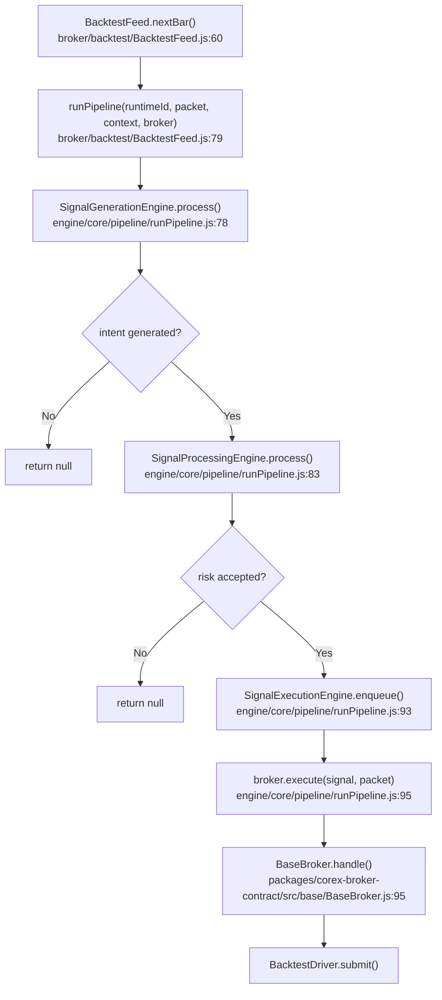
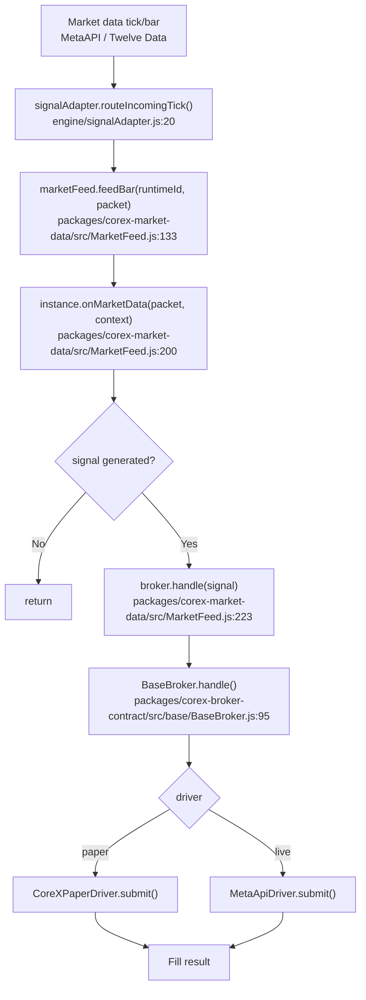
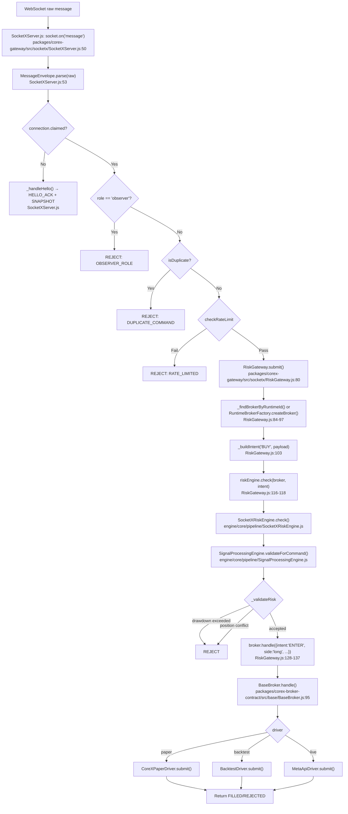
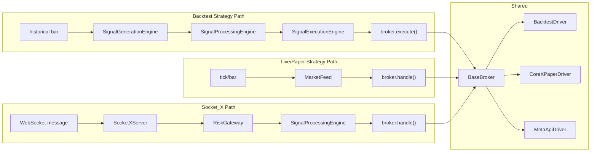

# CoreX — System Deep Dive

> **Date:** 2026-08-30
> **Scope:** Current-state reference for any AI agent or human picking up work cold.
> **Source:** Verified against actual code (post-commits f54f989..e456fcc, pushed to origin/main). Every claim cites `file:line`.

---

## 1. Package Profiles

### corex-broker-contract

**Owns:** The broker abstraction layer — the unified interface every trading driver implements and every order flows through.

**Public API** (`packages/corex-broker-contract/index.js`):

| Export | What it does |
|--------|--------------|
| `BrokerContract` | Abstract async interface: `submit`/`modify`/`cancel`/`query_status`. Standardized payload in, standardized `OrderResult` out. |
| `BaseBroker` | Abstract base class: risk-floor enforcement, payload normalization, `handle()`/`placeOrder()` orchestration, event emission. |
| `UnsupportedOperationError` | Typed error for driver-unsupported operations. |
| `BacktestDriver` | Historical simulation driver (uses `SharedFillSim`, position tracking, metrics). |
| `CoreXPaperDriver` | Native sandbox paper trading driver with virtual ledger. |
| `MetaApiDriver` | Live trading driver via MetaAPI/MT5 with cached broker state. |
| `MT5MQL5Connector` | MT5/MQL5 bridge connector wrapping `mt5Bridge`. |
| `MetaApiConnector` | Skeleton MetaAPI connector (structural placeholder, not end-to-end verified). |
| `RuntimeBrokerFactory` | Singleton factory creating broker instances per `(mode, symbol)` with same-symbol-one-driver enforcement. |
| `mt5Bridge` | WebSocket bridge for MT5 terminal communication. |
| `SharedFillSim` | Shared fill simulation (market/limit/stop, spread, commission, ATR) used by Backtest + Paper. |
| `SymbolNormalizer` | Canonical symbol normalization (uppercase, no separators) with `pip_scale`/`digits` metadata. |
| `DataPaginationLayer` | Auto-chunking pagination for large historical requests. |
| `STANDARD_METRICS_SHAPE`, `TRADE_RECORD_SHAPE`, `ACCOUNT_SNAPSHOT_SHAPE`, `ORDER_RESULT_SHAPE`, `STANDARD_ORDER_PAYLOAD` | Shape/type constants. |
| `BacktestBroker`, `PaperBroker`, `LiveBroker` | Aliases for the three drivers. |

**Dependencies:**
- On other packages: **none** (pure logic).
- On engine/: **none**.
- External: `@config/constants`, `@events/bus`, `@utils/logger`, `@utils/metrics`, `@utils/strategy/StrategyPositionManager`, `ws`, `events` (EventEmitter).
- What depends on it: `corex-gateway` (via `@broker/RuntimeBrokerFactory`), `corex-market-data` (via `SymbolNormalizer`, `DataPaginationLayer`), `engine/` (via shims).

**Test coverage:** 11 suites, 118 tests. Exercises: driver modes, factory, connectors, contract compliance, symbol normalization, fill simulation, pagination, base broker. **Untested:** MetaApiDriver live-mode end-to-end (requires real broker credentials).

**Known limitations:**
- Exactly 3 drivers: Backtest, Paper (CoreX), Live (MetaApi). No REST/MQL5 driver (removed 2026-08-23).
- `MetaApiConnector` is a skeleton stub — needs real credentials for verification.
- Single active driver per `(mode, symbol)` — enforced by `RuntimeBrokerFactory`.

---

### corex-market-data

**Owns:** Market data ingestion — provider abstraction, the factory/registry, the guarded historical fetcher, and the tick-to-runtime fan-out bridge.

**Public API** (`packages/corex-market-data/index.js`):

| Export | What it does |
|--------|--------------|
| `DataProviderFactory` | Singleton registry/dispatch: `register`, `setActive`, `connect`, `fetchHistorical`, `subscribe`, `unsubscribe`. Idempotent connect, single active provider, transparent `DataPaginationLayer` chunking. |
| `DataProviderContract` | Abstract contract class defining the required provider interface. |
| `validateProviderImplementation` | Fail-fast validator ensuring a provider implements all required methods. |
| `DataProviderError` | Typed error class for provider failures (with `MAX_CANDLES_EXCEEDED`). |
| `DATA_PROVIDER_CONTRACT_VERSION` | Contract version string (`"2026.1.21"`). |
| `TwelveDataProvider` | Adapter wrapping the legacy `@broker/twelvedata` singleton, normalizes symbols at boundary. |
| `FileDataProvider` | File-based provider for CSV/JSON/JSONL replay with `{type:"file", path, speed, loop, startOffset}`. |
| `YahooFinanceProvider` | Yahoo Finance provider via `yahoo-finance2` (needs real API keys for verification). |
| `fetchGuardedHistory` | Guarded historical fetcher enforcing 5000-bar cap with `DataProviderError`. |
| `MAX_BARS_LIMIT` | Constant = 5000. |

**Dependencies:**
- On other packages: `corex-broker-contract` (`SymbolNormalizer`, `DataPaginationLayer`).
- On engine/: **none** (since Phase 2 — `MarketFeed` uses injected deps, not direct `require`).
- External: `@events/bus`, `@utils/logger`, `@broker/twelvedata` (legacy singleton), `yahoo-finance2`, `fs`, `path`, `zlib`.
- What depends on it: `engine/` (via shims), `engine/backtestManager.js`, `engine/core/runtime/RuntimeLifecycle.js`.

**Injection pattern:** `MarketFeed` (`src/MarketFeed.js:42-45`) receives its dependencies via `setDeps({ registry, onStrategyCrash })`. Engine wires this in `engine/core/engine.js:127-130`. Test env falls back to no-op stubs; production throws if not injected.

**Test coverage:** 6 suites, 70 tests. Exercises: all three providers (with mocks), factory, contract validation, guarded resolver. **Untested:** `MarketFeed` tick fan-out (no direct tests), Yahoo Finance real API calls, provider mode-switch race conditions.

**Known limitations:**
- Single active provider at a time (enforced by factory).
- 5000-candle global backtest cap enforced at three gates.
- `YahooFinanceProvider` uses `yahoo-finance2` — unverified against live API.

---

### corex-auth

**Owns:** Cryptographic primitives — JWT signing/verification and AES-256-GCM encryption. The only package with zero external dependencies (pure `node:crypto`).

**Public API** (`packages/corex-auth/index.js`):

| Export | What it does |
|--------|--------------|
| `AuthService` | JWT signing/verification + password hashing module. |
| `SecretsVault` | AES-256-GCM encryption module with key rotation. |
| `signToken` | JWT HMAC-SHA256 signing. |
| `verifyToken` | JWT verification with expiry check. |
| `hashPassword` / `verifyPassword` | scrypt password hashing (timing-safe). |
| `encryptString` / `decryptString` | AES-256-GCM string encryption with key rotation fallback. |
| `encryptObjectSecrets` / `decryptObjectSecrets` | Encrypt/decrypt secret fields in an object. |
| `maskSecrets` | Deep-clone object with secrets replaced by `"<redacted>"`. |
| `rotateObjectSecrets` | Re-encrypt secrets under current key (rotation migration). |
| `isEncryptedString` | Check if a string has the `enc:v1:` prefix. |
| `reloadKeys` / `validateKeyConfig` | Key management: force reload from env, validate at startup. |
| `DecryptionError` | Typed error for decryption failures. |
| `PREFIX` | Encryption prefix string (`"enc:v1:"`). |
| `DEFAULT_SECRET_PATHS` | Default secret field paths for object encryption. |

**Dependencies:**
- On other packages: **none**.
- On engine/: **none**.
- External: **none** (only Node.js `crypto`).
- What depends on it: `engine/` (via shims), `corex-accounts` (`connectionsService` uses `secretsVault`), `engine/services/configService.js`.

**Test coverage:** 2 suites, 23 tests. Exercises: token sign/verify round-trip, password hash/verify, encrypt/decrypt, object secret masking, key rotation. **Untested:** none significant — this is a pure-logic package with full coverage.

**Known limitations:**
- JWT TTL is 30 days (no refresh token complexity; revocation via `corex_sessions` table).
- API key system removed (2026-08-21) — JWT-only auth path.

---

### corex-gateway

**Owns:** The Socket_X protocol boundary (WebSocket client communication), the account model, and the account HTTP routes. Sits **above** broker-contract in the stack.

**Public API** (`packages/corex-gateway/index.js`):

| Export | What it does |
|--------|--------------|
| `MessageEnvelope` | Socket_X protocol envelope: validation, factory methods (`helloAck`, `reject`, `snapshot`, `ping`, `fill`, `positionUpdate`, `ack`). |
| `REASON_CODES` | Array of valid reason code strings. |
| `SocketXConnection` | Per-connection state: heartbeat, token-bucket rate limiter, idempotency cache, role. |
| `SocketXServer` | Connection lifecycle server: HELLO handshake, command routing, idempotency cache keyed by `runtimeId`, observer role, injected auth verifier. |
| `RiskGateway` | Routes validated commands through `broker.handle()` with injected risk engine. |
| `Account` | Account model with validation (`type`, `brokerBinding`, `status`, limits). |
| `TradingAccountRepository` | PostgreSQL-backed account CRUD with per-user limits. |
| `InMemoryAccountRepository` | In-memory account repository for testing. |
| `generateAccountId` | Generate account ID (`cx_pap_<ulid>` / `cx_liv_<ulid>`). |
| `generateUlid` | Generate ULID string. |
| `parseAccountId` | Parse account ID into `{valid, type, ulid}`. |
| `createAccountRouter` | Express router for account HTTP endpoints. |

**Injection pattern:** Two injection points:
- `RiskGateway.setRiskEngine(engine)` — risk engine injected at startup (`RiskGateway.js:75-78`).
- `SocketXServer.setAuthVerifier(fn)` — auth verifier injected at startup (`SocketXServer.js:13`).
- Engine wires both in `engine/core/engine.js:118-126`.

**Dependencies:**
- On other packages: `corex-broker-contract` (`RuntimeBrokerFactory`).
- On engine/: **none**.
- External: `express`, `pg`, `dotenv`, `crypto`.
- What depends on it: `engine/` (via shims), `engine/routes/settingsController.js` (uses `TradingAccountRepository` directly).

**Test coverage:** 3 suites, 53 tests. Exercises: account model, account IDs, Socket_X protocol (HELLO, ACK, FILL, idempotency, roles, rate limiting), auth verifier injection. **Untested:** real WebSocket transport integration (verified against mock brokers only).

**Known limitations:**
- `TradingAccountRepository.getDefaultForUser(userId, accountType)` **requires** `accountType` — throws if omitted or not `paper`/`live` (`TradingAccountRepository.js:70-73`).
- `setDefault` scopes its `is_default = false` clear to the same account type only (`TradingAccountRepository.js:83-99`).
- Mode is resolved server-side from account record — client cannot assert mode.

---

### corex-accounts

**Owns:** Connection credential management (encrypted storage per account+connector) and broker settings persistence.

**Public API** (`packages/corex-accounts/index.js`):

| Export | What it does |
|--------|--------------|
| `connectionsService` | `ConnectionsService` instance: encrypted connection credential CRUD (connections table, AES-256-GCM via `secretsVault`, scoped to `accountId` + `connectorType`). |
| `CONNECTOR_SCHEMAS` | Schema definitions for `twelvedata` and `metaapi` connectors only. |
| `persistBrokerSettings` | Function: persists broker settings per `userId`+`mode` into `user_broker_settings`; listens to `EVENTS.BROKER.STATE_CHANGED`. |

**Dependencies:**
- On other packages: **none**.
- On engine/: **none** (uses `@core/services/secretsVault` and `@core/services/pgStore` aliases — these resolve to engine/ files, but the package itself contains the real logic).
- External: `@events/bus`, `@utils/logger`, `pg`.
- What depends on it: `engine/` (via shims), `engine/services/connectorSettingsService.js` shim.

**Test coverage:** 1 suite, 3 tests. Exercises: connection CRUD, connector schema pruning (confirms `mt5_bridge`/`oanda` absent). **Untested:** `persistBrokerSettings` function (no direct tests), multi-account credential isolation (relies on integration tests elsewhere).

**Known limitations:**
- `CONNECTOR_SCHEMAS` has exactly 2 connectors: `twelvedata` and `metaapi`. `mt5_bridge` and `oanda` are permanently prohibited (locked boundary — see Section 3).
- `persistBrokerSettings` uses `pgStore.upsertBrokerSettingsForUser()` (centralized data access via `pgStore`).

---

## 2. Architecture Flow Diagrams

### 2.1 System Dependency Graph

```mermaid
graph TD
    subgraph Packages
        A[corex-broker-contract]
        B[corex-market-data]
        C[corex-auth]
        D[corex-gateway]
        E[corex-accounts]
    end

    subgraph Engine
        F[engine/]
    end

    F -->|@broker/corex-gateway| D
    F -->|@auth/corex-auth| C
    F -->|@data/src/*| B
    F -->|corex-accounts| E
    F -->|packages/.../RuntimeBrokerFactory| A
    F -->|packages/.../mt5Bridge| A
    F -->|packages/.../TradingAccountRepository| D

    E -->|@core/services/secretsVault → shim →| C
    E -->|@core/services/pgStore → engine| F
    B -->|SymbolNormalizer, DataPaginationLayer| A
    D -->|RuntimeBrokerFactory| A
```

**Key:** Packages never import from `engine/` directly. The one apparent exception — `corex-accounts` using `@core/services/pgStore` — resolves to an engine/ file, but the package owns the business logic; `pgStore` is a data-access utility, not a higher-level service. `corex-market-data` uses dependency injection (`MarketFeed.setDeps()`) to avoid importing `RuntimeRegistry` or `engine` directly.

---

### 2.2 Strategy Signal Path

**Important:** The three pipeline engines (`SignalGenerationEngine`, `SignalProcessingEngine`, `SignalExecutionEngine`) are currently used **only in backtest mode** via `runPipeline.js`. In live/paper mode, strategy signals bypass the pipeline entirely and flow through `MarketFeed` directly. Both paths are documented below.

#### 2.2a Backtest Strategy Path (through pipeline engines)



**Entry point:** `BacktestFeed.nextBar()` (`broker/backtest/BacktestFeed.js:60`) — iterates historical bars during a backtest run. **Exit:** `broker.execute()` (the pipeline's execution interface).

#### 2.2b Live/Paper Strategy Path (bypasses pipeline engines)



**Entry point:** `signalAdapter.routeIncomingTick()` (`engine/signalAdapter.js:20`) — called when external market data arrives. **Exit:** `broker.handle()` (the direct command interface). Note: this path does NOT invoke `SignalGenerationEngine`, `SignalProcessingEngine`, or `SignalExecutionEngine`.

---

### 2.3 Socket_X Client Command Path (external orders)

For orders submitted by external clients via WebSocket.



**Entry point:** `SocketXServer.js:50` (`socket.on('message')`). **Exit:** `broker.handle()` → `driver.submit()` (distinct from `broker.execute()`).

---

### 2.4 Path Convergence and Divergence



**Divergence:**
- Backtest strategy path uses `broker.execute()` (`runPipeline.js:95`) — the strategy pipeline's execution interface. This is the only path that flows through all three pipeline engines.
- Live/Paper strategy path uses `broker.handle()` (`MarketFeed.js:223`) — bypasses the pipeline engines entirely.
- Socket_X path uses `broker.handle()` (`RiskGateway.js:128`) — invokes only `SignalProcessingEngine` (via `SocketXRiskEngine`) for portfolio risk validation.

**Convergence:** All three paths meet at `BaseBroker.handle()` (`packages/corex-broker-contract/src/base/BaseBroker.js:95`), then flow into the same driver (`submit()`).

**Key finding:** The three pipeline engines (`SignalGenerationEngine`, `SignalProcessingEngine`, `SignalExecutionEngine`) are currently **backtest-only**. They are not invoked in the live/paper strategy path or the Socket_X path. This is consistent with the Phase 4 decision: `broker.execute()` (pipeline) and `broker.handle()` (direct) are distinct entry points for distinct order sources.

---

## 3. Locked Decisions Summary

One line per locked decision. Full entries in `plans/decisions.md`.

| # | Decision | Location |
|---|----------|----------|
| 1 | `BrokerContract` = unified async interface (`submit`/`modify`/`cancel`/`query_status`) | decisions.md:10 |
| 2 | Strategy code is mode-agnostic — same strategy runs against any driver | decisions.md:11 |
| 3 | Global symbol normalization at every driver AND data source boundary | decisions.md:13 |
| 4 | `CoreXPaperDriver` owns local virtual ledger; shares `SharedFillSim` with `BacktestDriver` | decisions.md:14 |
| 5 | Account state ownership is mode-specific (Live queries external broker; Paper/Backtest use local ledger) | decisions.md:16 |
| 6 | One active market data provider at a time; internal pagination auto-chunks | decisions.md:17 |
| 7 | Session scoped to `(mode, symbol, driver)` — same symbol cannot run two drivers simultaneously | decisions.md:22 |
| 8 | Socket_X is a protocol boundary **above** BrokerContract (not a replacement) | decisions.md:119 |
| 9 | Socket_X enforces 5 non-negotiable rules: idempotency, exclusivity, rate limiting, mode-agnostic, risk gate | decisions.md:122-125 |
| 10 | Socket_X auth verification via dependency injection (`SocketXServer.setAuthVerifier`) | decisions.md:162-167 |
| 11 | `trading_accounts` is the single source of truth for account identity (duplicate `accounts` table dropped) | decisions.md:175-187 |
| 12 | `getDefaultForUser(userId, accountType)` requires `accountType`; `setDefault` scoped to same type | decisions.md:214-218 |
| 13 | MarketFeed dependencies injected via `setDeps()` — package never reaches back into engine/ | decisions.md:234-238 |
| 14 | `brokerPersistenceService` logic lives in package; engine/services/brokerPersistence.js is a shim | decisions.md:244-248 |
| 15 | Socket_X commands bypass `SignalGenerationEngine`/`SignalExecutionEngine` (intentional) | decisions.md:254-261 |

### Permanent Prohibitions (violated twice before — check before acting)

1. **`mt5_bridge` and `oanda` must NOT be re-added as live-selectable connector types.** This is the second time they have been removed (first: 2026-08-23, re-added silently by an agent inferring from old code). `mt5_bridge` has zero real instantiation. Locked boundary, not a scope decision. (decisions.md:185)

2. **No separate server/auth-http package.** Auth extraction is limited to the two pure-logic files (`authService`, `secretsVault`). DB/Express-coupled code stays in `engine/`. (decisions.md:82)

---

## 4. Current Build State

| Package/Area | Status | Last verified | Known open items |
|--------------|--------|---------------|------------------|
| corex-broker-contract | **Done** | 2026-08-30 | MetaApiConnector skeleton needs real credentials for e2e verification |
| corex-market-data | **Done** | 2026-08-30 | Yahoo Finance unverified against live API; MarketFeed has no direct tests |
| corex-auth | **Done** | 2026-08-30 | None — pure logic, fully tested |
| corex-gateway | **Done** | 2026-08-30 | Real WebSocket transport not end-to-end verified |
| corex-accounts | **Done** | 2026-08-30 | `persistBrokerSettings` has no direct tests |
| corex-portfolio | **Not started** | — | Planned package — no code exists |
| corex-strategy-engine | **Not started** | — | Planned package — no code exists |
| corex-risk | **Not started** | — | Planned package — no code exists |
| corex-state | **Not started** | — | Planned package — no code exists |
| corex-jobs | **Not started** | — | Planned package — no code exists |
| corex-realtime | **Not started** | — | Planned package — no code exists |
| corex-engine (orchestrator) | **Not started** | — | Planned package — no code exists |
| Frontend modularization | **Not started** | — | Planned (Issue #10) |
| engine/ composition root | **Ongoing** | 2026-08-30 | Still contains business logic (strategyCompiler, backtestManager, pipeline engines, etc.) — extraction target |

**Test totals:** 424 pass / 11 fail. The 11 failures are 2 pre-existing suites (`liveBroker.events.test.js`, `round7.comprehensive.test.js`) — MetaApiDriver live mode + security.js issues, unchanged through all phases.

---

## 5. How To Work In This Codebase

### Always check `plans/decisions.md` before assuming what code is "supposed" to do

The two permanent prohibitions (mt5_bridge/oanda, no server package) have both been violated by agents inferring intent from old code instead of reading the decisions log. The decisions file is the spec — old code is not.

### This is a rebuild via strangler-fig extraction, not a patch effort

The target architecture (defined 2026-08-22) is a modular monolith: `engine/` becomes a thin composition root, all business logic lives in packages, packages communicate via `@events/bus`. Old monolith tests testing package internals are being replaced by integration tests — don't fix old tests, write new ones.

### Re-export shims exist in engine/ for every extracted package

Never assume a file in `engine/services/` contains real logic without checking if it's a shim first. Current shims:
- `engine/services/authService.js` → `packages/corex-auth/src/AuthService.js`
- `engine/services/secretsVault.js` → `packages/corex-auth/src/SecretsVault.js`
- `engine/services/mt5Bridge.js` → `packages/corex-broker-contract/src/mt5Bridge.js`
- `engine/services/brokerPersistence.js` → `packages/corex-accounts/src/brokerPersistenceService.js`
- `engine/services/connectorSettingsService.js` → `packages/corex-accounts/`
- `engine/core/backtestDataResolver.js` → `packages/corex-market-data/src/backtestDataResolver.js`
- `engine/core/runtime/RuntimeBrokerFactory.js` → `packages/corex-broker-contract/src/RuntimeBrokerFactory.js`
- `engine/core/runtime/MarketFeed.js` → `packages/corex-market-data/src/MarketFeed.js`
- `engine/core/data/providers/TwelveDataProvider.js` → `packages/corex-market-data/src/providers/TwelveDataProvider.js`
- `engine/core/data/DataProviderContract.js` → `packages/corex-market-data/src/DataProviderContract.js`

A shim is typically 1-3 lines: `module.exports = require("../../packages/...")`.

### When uncertain, report before implementing

If something looks architecturally coupled or a fix seems to require changing a protected boundary, stop and report. This is exactly the kind of thing that needs a decision, not a guess. The `plans/decisions.md` file exists to capture these — append a new dated entry, never modify existing ones.
