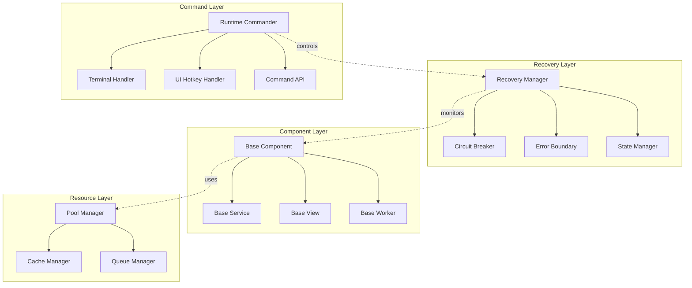

# Corex Crash Recovery & Component Standardization Architecture

**Version:** 1.0  
**Date:** 2026-02-25  
**Status:** Architecture Design

---

## Executive Summary

This document outlines a comprehensive architecture for implementing crash recovery, error clearing, runtime commands, and component standardization across the Corex trading platform. The solution addresses:

1. **Crash Recovery** - Automatic recovery from errors without manual intervention
2. **Error Clearing** - On-the-run recovery of system components and strategies
3. **Runtime Commands** - CTRL+R and other hotkeys for system control (UI + Terminal)
4. **Component Standardization** - Unified patterns for backend services and frontend views
5. **Resource Optimization** - Efficient data structures to reduce memory/CPU usage

---

## Current State Analysis

### Existing Strengths
- ✅ [`ComponentLifecycle`](engine/core/lifecycle/ComponentLifecycle.js) system for state tracking
- ✅ Event bus ([`bus`](events/bus.js)) for system-wide communication
- ✅ Health check system ([`healthCheck.js`](engine/services/healthCheck.js))
- ✅ Modular logger with UI integration ([`logger.js`](utils/logger.js))
- ✅ Strategy bootloader with phase-based initialization ([`strategyLoader.js`](engine/strategyLoader.js))
- ✅ FastQueue implementation for tick processing ([`engine.js`](engine/core/engine.js))

### Current Gaps
- ❌ No automatic recovery from component failures
- ❌ No circuit breaker pattern for failing services
- ❌ No error boundary system for strategy isolation
- ❌ No runtime command interface
- ❌ Inconsistent error handling patterns (silent catches)
- ❌ No standardized component base classes
- ❌ Frontend views lack consistent structure
- ❌ Memory leaks possible in long-running strategies

---

## Architecture Overview



---

## 1. Crash Recovery System

### 1.1 Recovery Manager

**Location:** `engine/core/recovery/RecoveryManager.js`

Central orchestrator for all recovery operations.

**Features:**
- Component health monitoring
- Automatic restart on failure
- Graceful degradation
- Recovery history tracking
- Configurable retry policies

**API:**
```javascript
class RecoveryManager {
    // Register a component for monitoring
    register(component, options = {})
    
    // Manually trigger recovery
    recover(componentId, strategy = 'restart')
    
    // Get recovery status
    getStatus(componentId)
    
    // Configure recovery policies
    setPolicy(componentId, policy)
}
```

**Recovery Strategies:**
- `restart` - Full component restart
- `reset` - Reset state without restart
- `isolate` - Quarantine failing component
- `fallback` - Switch to backup implementation

### 1.2 Circuit Breaker Pattern

**Location:** `engine/core/recovery/CircuitBreaker.js`

Prevents cascading failures by monitoring error rates.

**States:**
- `CLOSED` - Normal operation
- `OPEN` - Blocking requests (cooling down)
- `HALF_OPEN` - Testing recovery

**Configuration:**
```javascript
{
    failureThreshold: 5,        // Failures before opening
    successThreshold: 2,        // Successes to close
    timeout: 60000,            // Cooldown period (ms)
    monitoringPeriod: 10000    // Rolling window (ms)
}
```

### 1.3 Error Boundary System

**Location:** `engine/core/recovery/ErrorBoundary.js`

Isolates strategy errors from affecting the engine.

**Features:**
- Strategy-level isolation
- Error capture and logging
- Automatic strategy restart
- Error rate limiting
- Quarantine mode for persistent failures

**Integration Points:**
- Wrap strategy execution in [`strategyLoader.js`](engine/strategyLoader.js)
- Integrate with [`ComponentLifecycle`](engine/core/lifecycle/ComponentLifecycle.js)
- Report to [`healthCheck.js`](engine/services/healthCheck.js)

### 1.4 State Snapshot & Restore

**Location:** `engine/core/recovery/StateManager.js`

Enables recovery to last known good state.

**Features:**
- Periodic state snapshots
- Incremental state updates
- Fast state restoration
- Configurable retention policy

**Snapshot Targets:**
- Engine state (subscriptions, contexts)
- Strategy state (positions, indicators)
- Connection state (WebSocket, MT5)
- Queue state (pending ticks, orders)

---

## 2. Runtime Command System

### 2.1 Runtime Commander

**Location:** `engine/core/commands/RuntimeCommander.js`

Central command dispatcher for runtime operations.

**Command Registry:**

| Command | Shortcut | Action | Scope |
|---------|----------|--------|-------|
| `restart` | CTRL+R | Restart Corex server | System |
| `reload-strategies` | CTRL+SHIFT+R | Reload all strategies | Strategies |
| `clear-errors` | CTRL+E | Clear all error states | Recovery |
| `gc` | CTRL+G | Force garbage collection | System |
| `snapshot` | CTRL+S | Save system snapshot | State |
| `restore` | CTRL+SHIFT+S | Restore from snapshot | State |
| `pause` | CTRL+P | Pause strategy execution | Strategies |
| `resume` | CTRL+SHIFT+P | Resume strategies | Strategies |
| `health` | CTRL+H | Run health check | System |
| `logs` | CTRL+L | Toggle log level | System |

**API:**
```javascript
class RuntimeCommander {
    // Register a command
    register(name, handler, options = {})
    
    // Execute a command
    execute(name, args = {})
    
    // Get command status
    getStatus(name)
    
    // List available commands
    list()
}
```

### 2.2 Terminal Handler

**Location:** `engine/core/commands/TerminalHandler.js`

Handles keyboard input in the terminal where Node.js runs.

**Implementation:**
```javascript
const readline = require('readline');

class TerminalHandler {
    constructor(commander) {
        this.commander = commander;
        this.setupKeyBindings();
    }
    
    setupKeyBindings() {
        readline.emitKeypressEvents(process.stdin);
        if (process.stdin.isTTY) {
            process.stdin.setRawMode(true);
        }
        
        process.stdin.on('keypress', (str, key) => {
            if (key.ctrl && key.name === 'r') {
                this.commander.execute('restart');
            }
            // ... more bindings
        });
    }
}
```

**Features:**
- Non-blocking input handling
- Visual feedback in terminal
- Command history
- Auto-completion
- Help system (CTRL+?)

### 2.3 UI Hotkey Handler

**Location:** `corex-ui/src/services/HotkeyManager.js`

Handles keyboard shortcuts in the web UI.

**Implementation:**
```javascript
class HotkeyManager {
    constructor() {
        this.bindings = new Map();
        this.setupGlobalListener();
    }
    
    register(key, handler, options = {}) {
        const binding = {
            key,
            ctrl: options.ctrl || false,
            shift: options.shift || false,
            alt: options.alt || false,
            handler
        };
        this.bindings.set(this.getBindingKey(binding), binding);
    }
    
    setupGlobalListener() {
        document.addEventListener('keydown', (e) => {
            const key = this.getBindingKey({
                key: e.key.toLowerCase(),
                ctrl: e.ctrlKey,
                shift: e.shiftKey,
                alt: e.altKey
            });
            
            const binding = this.bindings.get(key);
            if (binding) {
                e.preventDefault();
                binding.handler(e);
            }
        });
    }
}
```

**UI Integration:**
- Command palette (CTRL+K)
- Visual feedback for commands
- Toast notifications
- Confirmation dialogs for destructive actions

### 2.4 Command API Endpoint

**Location:** `engine/routes/commandController.js`

REST API for command execution.

**Endpoints:**
```
POST   /api/commands/execute
GET    /api/commands/list
GET    /api/commands/:name/status
POST   /api/commands/:name/cancel
```

**Security:**
- Requires admin authentication
- Rate limiting
- Audit logging
- Command validation

---

## 3. Component Standardization

### 3.1 Base Component Class

**Location:** `engine/core/base/BaseComponent.js`

Foundation for all backend components.

**Features:**
```javascript
class BaseComponent {
    constructor(name, options = {}) {
        this.name = name;
        this.lifecycle = new ComponentLifecycle(name, options);
        this.logger = logger.createModuleLogger(name, options);
        this.errorBoundary = new ErrorBoundary(name);
        this.circuitBreaker = new CircuitBreaker(name, options.circuit);
        this.metrics = new MetricsCollector(name);
    }
    
    // Lifecycle hooks (must implement)
    async initialize() { throw new Error('Not implemented'); }
    async start() { throw new Error('Not implemented'); }
    async stop() { throw new Error('Not implemented'); }
    async cleanup() { throw new Error('Not implemented'); }
    
    // Error handling (built-in)
    async safeExecute(fn, fallback = null) {
        return this.errorBoundary.wrap(async () => {
            return await this.circuitBreaker.execute(fn);
        }, fallback);
    }
    
    // State management (built-in)
    snapshot() { return this.lifecycle.snapshot(); }
    restore(state) { /* restore logic */ }
    
    // Metrics (built-in)
    recordMetric(name, value) { this.metrics.record(name, value); }
    getMetrics() { return this.metrics.getAll(); }
}
```

**Usage Example:**
```javascript
class StrategyManager extends BaseComponent {
    constructor() {
        super('STRATEGY_MANAGER', { category: 'strategy' });
    }
    
    async initialize() {
        this.strategies = new Map();
        this.lifecycle.transition(STATES.INITIALIZING);
        // ... initialization logic
        this.lifecycle.transition(STATES.READY);
    }
    
    async loadStrategy(id) {
        return this.safeExecute(async () => {
            // Load strategy logic
            this.recordMetric('strategies_loaded', 1);
        }, null);
    }
}
```

### 3.2 Base Service Class

**Location:** `engine/core/base/BaseService.js`

Specialized base for singleton services.

**Additional Features:**
- Singleton pattern enforcement
- Dependency injection
- Service registry integration
- Health check integration

### 3.3 Base Worker Class

**Location:** `engine/core/base/BaseWorker.js`

For background processing tasks.

**Additional Features:**
- Job queue management
- Concurrency control
- Progress tracking
- Cancellation support

### 3.4 Frontend Base View

**Location:** `corex-ui/src/components/base/BaseView.jsx`

Standardized React component for views.

**Features:**
```javascript
class BaseView extends React.Component {
    constructor(props) {
        super(props);
        this.state = {
            loading: false,
            error: null,
            data: null
        };
        this.errorBoundary = new ErrorBoundary();
    }
    
    // Lifecycle hooks
    async onMount() { /* override */ }
    async onUnmount() { /* override */ }
    async onRefresh() { /* override */ }
    
    // Error handling
    handleError(error) {
        this.setState({ error: error.message });
        this.errorBoundary.capture(error);
    }
    
    // Loading states
    setLoading(loading) {
        this.setState({ loading });
    }
    
    // Standard layout
    render() {
        return (
            <div className="base-view">
                {this.renderHeader()}
                {this.state.loading && this.renderLoading()}
                {this.state.error && this.renderError()}
                {!this.state.loading && !this.state.error && this.renderContent()}
            </div>
        );
    }
    
    // Must implement
    renderContent() { throw new Error('Not implemented'); }
    
    // Optional overrides
    renderHeader() { return null; }
    renderLoading() { return <LoadingSpinner />; }
    renderError() { return <ErrorDisplay error={this.state.error} />; }
}
```

**Functional Component Version:**
```javascript
function useBaseView(options = {}) {
    const [loading, setLoading] = useState(false);
    const [error, setError] = useState(null);
    const [data, setData] = useState(null);
    
    const errorBoundary = useMemo(() => new ErrorBoundary(), []);
    
    const safeExecute = useCallback(async (fn) => {
        setLoading(true);
        setError(null);
        try {
            const result = await fn();
            setData(result);
            return result;
        } catch (err) {
            setError(err.message);
            errorBoundary.capture(err);
            return null;
        } finally {
            setLoading(false);
        }
    }, [errorBoundary]);
    
    return { loading, error, data, setData, safeExecute };
}
```

---

## 4. Resource Optimization

### 4.1 Object Pooling

**Location:** `utils/pools/ObjectPool.js`

Reuse objects instead of creating new ones.

**Use Cases:**
- Tick objects
- Order objects
- Indicator calculation buffers
- WebSocket message objects

**Implementation:**
```javascript
class ObjectPool {
    constructor(factory, reset, options = {}) {
        this.factory = factory;
        this.reset = reset;
        this.pool = [];
        this.maxSize = options.maxSize || 1000;
        this.created = 0;
        this.reused = 0;
    }
    
    acquire() {
        if (this.pool.length > 0) {
            this.reused++;
            return this.pool.pop();
        }
        this.created++;
        return this.factory();
    }
    
    release(obj) {
        if (this.pool.length < this.maxSize) {
            this.reset(obj);
            this.pool.push(obj);
        }
    }
    
    getStats() {
        return {
            poolSize: this.pool.length,
            created: this.created,
            reused: this.reused,
            reuseRate: this.reused / (this.created + this.reused)
        };
    }
}
```

### 4.2 Circular Buffer

**Location:** `utils/structures/CircularBuffer.js`

Fixed-size buffer for time-series data.

**Benefits:**
- O(1) append and read
- No memory growth
- Cache-friendly
- Perfect for indicator windows

**Implementation:**
```javascript
class CircularBuffer {
    constructor(capacity) {
        this.buffer = new Array(capacity);
        this.capacity = capacity;
        this.size = 0;
        this.head = 0;
    }
    
    push(value) {
        this.buffer[this.head] = value;
        this.head = (this.head + 1) % this.capacity;
        if (this.size < this.capacity) this.size++;
    }
    
    get(index) {
        if (index >= this.size) return undefined;
        const pos = (this.head - this.size + index + this.capacity) % this.capacity;
        return this.buffer[pos];
    }
    
    toArray() {
        const result = new Array(this.size);
        for (let i = 0; i < this.size; i++) {
            result[i] = this.get(i);
        }
        return result;
    }
}
```

### 4.3 Memory-Efficient Queue

**Location:** `utils/structures/RingQueue.js`

Improved version of FastQueue with better memory characteristics.

**Improvements over current FastQueue:**
- Circular buffer instead of array slicing
- Configurable capacity limits
- Memory pressure monitoring
- Automatic compaction

### 4.4 Cache Manager

**Location:** `engine/core/cache/CacheManager.js`

Unified caching layer with eviction policies.

**Features:**
- LRU eviction
- TTL support
- Memory limits
- Cache warming
- Hit/miss metrics

**Eviction Policies:**
- `LRU` - Least Recently Used
- `LFU` - Least Frequently Used
- `TTL` - Time To Live
- `SIZE` - Size-based limits

---

## 5. Implementation Plan

### Phase 1: Recovery Foundation (Week 1)

**Files to Create:**
```
engine/core/recovery/
├── RecoveryManager.js
├── CircuitBreaker.js
├── ErrorBoundary.js
└── StateManager.js
```

**Tasks:**
1. Implement RecoveryManager with basic restart capability
2. Implement CircuitBreaker with state machine
3. Implement ErrorBoundary for strategy isolation
4. Implement StateManager with snapshot/restore
5. Integrate with existing ComponentLifecycle
6. Add recovery tests

**Integration Points:**
- Modify [`strategyLoader.js`](engine/strategyLoader.js) to use ErrorBoundary
- Modify [`engine.js`](engine/core/engine.js) to use RecoveryManager
- Update [`healthCheck.js`](engine/services/healthCheck.js) to monitor recovery

### Phase 2: Runtime Commands (Week 2)

**Files to Create:**
```
engine/core/commands/
├── RuntimeCommander.js
├── TerminalHandler.js
└── CommandRegistry.js

engine/routes/
└── commandController.js

corex-ui/src/services/
├── HotkeyManager.js
└── CommandClient.js

corex-ui/src/components/
└── CommandPalette.jsx
```

**Tasks:**
1. Implement RuntimeCommander with command registry
2. Implement TerminalHandler for Node.js process
3. Implement HotkeyManager for UI
4. Create command API endpoints
5. Build CommandPalette UI component
6. Add command documentation

**Commands to Implement:**
- System: restart, gc, health, logs
- Strategies: reload, pause, resume, clear-errors
- State: snapshot, restore
- Debug: inspect, trace, profile

### Phase 3: Component Standardization (Week 3)

**Files to Create:**
```
engine/core/base/
├── BaseComponent.js
├── BaseService.js
└── BaseWorker.js

corex-ui/src/components/base/
├── BaseView.jsx
├── useBaseView.js
└── ErrorBoundary.jsx

utils/
└── MetricsCollector.js
```

**Tasks:**
1. Implement BaseComponent with lifecycle hooks
2. Implement BaseService for singletons
3. Implement BaseWorker for background tasks
4. Implement BaseView for React components
5. Create migration guide for existing components
6. Refactor 2-3 components as examples

**Migration Priority:**
1. [`strategyManager.js`](engine/managers/strategyManager.js) → BaseService
2. [`backtestManager.js`](engine/backtestManager.js) → BaseService
3. [`HomeView.jsx`](corex-ui/src/views/HomeView.jsx) → BaseView
4. [`StrategyView.jsx`](corex-ui/src/views/StrategyView.jsx) → BaseView

### Phase 4: Resource Optimization (Week 4)

**Files to Create:**
```
utils/pools/
├── ObjectPool.js
└── PoolManager.js

utils/structures/
├── CircularBuffer.js
├── RingQueue.js
└── LRUCache.js

engine/core/cache/
├── CacheManager.js
└── EvictionPolicy.js
```

**Tasks:**
1. Implement ObjectPool for tick/order objects
2. Implement CircularBuffer for indicator data
3. Implement RingQueue to replace FastQueue
4. Implement CacheManager with eviction policies
5. Profile memory usage before/after
6. Document performance improvements

**Optimization Targets:**
- Tick processing: 30% memory reduction
- Indicator calculations: 40% memory reduction
- WebSocket messages: 50% allocation reduction
- Overall: 25% memory footprint reduction

### Phase 5: Integration & Testing (Week 5)

**Tasks:**
1. Integration testing of all components
2. Load testing with recovery scenarios
3. UI testing of hotkeys and commands
4. Performance benchmarking
5. Documentation updates
6. Migration of remaining components

---

## 6. Configuration

### 6.1 Recovery Configuration

**Location:** `config/recovery.js`

```javascript
module.exports = {
    recovery: {
        enabled: true,
        maxRetries: 3,
        retryDelay: 5000,
        strategies: {
            default: 'restart',
            engine: 'restart',
            strategy: 'isolate',
            broker: 'fallback'
        }
    },
    
    circuitBreaker: {
        failureThreshold: 5,
        successThreshold: 2,
        timeout: 60000,
        monitoringPeriod: 10000
    },
    
    errorBoundary: {
        maxErrorsPerMinute: 10,
        quarantineThreshold: 5,
        quarantineDuration: 300000
    },
    
    stateManager: {
        snapshotInterval: 60000,
        maxSnapshots: 10,
        compressionEnabled: true
    }
};
```

### 6.2 Command Configuration

**Location:** `config/commands.js`

```javascript
module.exports = {
    commands: {
        enabled: true,
        terminal: {
            enabled: true,
            prompt: 'corex> ',
            historySize: 100
        },
        ui: {
            enabled: true,
            palette: true,
            confirmDestructive: true
        },
        api: {
            enabled: true,
            rateLimit: 10,
            requireAuth: true
        }
    },
    
    hotkeys: {
        restart: { key: 'r', ctrl: true },
        reloadStrategies: { key: 'r', ctrl: true, shift: true },
        clearErrors: { key: 'e', ctrl: true },
        gc: { key: 'g', ctrl: true },
        snapshot: { key: 's', ctrl: true },
        restore: { key: 's', ctrl: true, shift: true },
        pause: { key: 'p', ctrl: true },
        resume: { key: 'p', ctrl: true, shift: true },
        health: { key: 'h', ctrl: true },
        logs: { key: 'l', ctrl: true },
        palette: { key: 'k', ctrl: true }
    }
};
```

### 6.3 Resource Configuration

**Location:** `config/resources.js`

```javascript
module.exports = {
    pools: {
        tick: {
            enabled: true,
            maxSize: 10000,
            preAllocate: 1000
        },
        order: {
            enabled: true,
            maxSize: 5000,
            preAllocate: 500
        },
        message: {
            enabled: true,
            maxSize: 5000,
            preAllocate: 500
        }
    },
    
    cache: {
        enabled: true,
        maxMemoryMB: 512,
        evictionPolicy: 'LRU',
        ttl: 3600000
    },
    
    queues: {
        tick: {
            type: 'ring',
            capacity: 10000,
            dropPolicy: 'oldest'
        },
        strategy: {
            type: 'ring',
            capacity: 5000,
            dropPolicy: 'oldest'
        }
    }
};
```

---

## 7. Monitoring & Metrics

### 7.1 Recovery Metrics

**Tracked Metrics:**
- Recovery attempts (total, success, failure)
- Recovery duration (avg, min, max)
- Circuit breaker state changes
- Error boundary captures
- Quarantined components

**Dashboard Integration:**
Add to [`HomeView.jsx`](corex-ui/src/views/HomeView.jsx):
```javascript
<RecoveryStatusCard
    recoveries={pulse?.recovery?.total || 0}
    failures={pulse?.recovery?.failures || 0}
    quarantined={pulse?.recovery?.quarantined || 0}
/>
```

### 7.2 Command Metrics

**Tracked Metrics:**
- Command executions (by type)
- Command duration
- Command failures
- Hotkey usage statistics

### 7.3 Resource Metrics

**Tracked Metrics:**
- Pool utilization (size, reuse rate)
- Cache hit/miss ratio
- Queue depth and drops
- Memory usage (heap, RSS)
- GC statistics

**Performance Targets:**
- Pool reuse rate: >80%
- Cache hit rate: >70%
- Queue drops: <1%
- Memory growth: <5% per hour

---

## 8. Error Handling Standards

### 8.1 Error Classification

**Categories:**
- `RECOVERABLE` - Can be automatically recovered
- `DEGRADED` - Partial functionality available
- `CRITICAL` - Requires manual intervention
- `FATAL` - System must shut down

### 8.2 Error Response Matrix

| Component | Error Type | Strategy | Notification |
|-----------|-----------|----------|--------------|
| Engine | CRITICAL | restart | UI + Log |
| Strategy | RECOVERABLE | isolate | Log only |
| Broker | DEGRADED | fallback | UI + Log |
| Database | CRITICAL | restart | UI + Log + Alert |
| WebSocket | RECOVERABLE | reconnect | Log only |
| MT5 Bridge | DEGRADED | queue | UI + Log |

### 8.3 Logging Standards

**Replace silent catches:**
```javascript
// ❌ Bad - Silent failure
try {
    await operation();
} catch { /* ignore */ }

// ✅ Good - Logged and handled
try {
    await operation();
} catch (err) {
    this.logger.warn('Operation failed, using fallback', { error: err.message });
    return fallback();
}
```

**Error context:**
```javascript
this.logger.error('Strategy execution failed', {
    strategyId: strategy.id,
    symbol: tick.symbol,
    error: err.message,
    stack: err.stack,
    context: {
        tickCount: this.tickCount,
        queueDepth: this.queue.length
    }
});
```

---

## 9. Testing Strategy

### 9.1 Recovery Testing

**Test Scenarios:**
1. Strategy crash during tick processing
2. Database connection loss
3. WebSocket disconnection
4. MT5 bridge failure
5. Memory exhaustion
6. Cascading failures

**Test Framework:**
```javascript
describe('RecoveryManager', () => {
    it('should restart failed component', async () => {
        const component = new TestComponent();
        const recovery = new RecoveryManager();
        recovery.register(component);
        
        // Simulate failure
        component.fail(new Error('Test error'));
        
        // Wait for recovery
        await sleep(1000);
        
        expect(component.lifecycle.state).toBe(STATES.RUNNING);
    });
});
```

### 9.2 Command Testing

**Test Scenarios:**
1. Command execution via API
2. Hotkey handling in UI
3. Terminal command processing
4. Command cancellation
5. Concurrent command execution

### 9.3 Performance Testing

**Benchmarks:**
1. Tick processing throughput (with/without pools)
2. Memory usage over 24 hours
3. Recovery time from failures
4. Command execution latency
5. Cache hit rates

---

## 10. Migration Guide

### 10.1 Migrating to BaseComponent

**Before:**
```javascript
class StrategyManager {
    constructor() {
        this.strategies = new Map();
        this.logger = logger.createModuleLogger('STRATEGY_MANAGER');
    }
    
    async loadStrategy(id) {
        try {
            // Load logic
        } catch (err) {
            this.logger.error('Load failed', err);
        }
    }
}
```

**After:**
```javascript
class StrategyManager extends BaseComponent {
    constructor() {
        super('STRATEGY_MANAGER', { category: 'strategy' });
    }
    
    async initialize() {
        this.strategies = new Map();
        this.lifecycle.transition(STATES.READY);
    }
    
    async loadStrategy(id) {
        return this.safeExecute(async () => {
            // Load logic
            this.recordMetric('strategies_loaded', 1);
        });
    }
}
```

### 10.2 Migrating to BaseView

**Before:**
```javascript
const HomeView = () => {
    const [loading, setLoading] = useState(false);
    const [error, setError] = useState(null);
    const { pulse } = useStore();
    
    useEffect(() => {
        fetchData();
    }, []);
    
    const fetchData = async () => {
        setLoading(true);
        try {
            // Fetch logic
        } catch (err) {
            setError(err.message);
        } finally {
            setLoading(false);
        }
    };
    
    if (loading) return <LoadingSpinner />;
    if (error) return <ErrorDisplay error={error} />;
    
    return <div>Content</div>;
};
```

**After:**
```javascript
const HomeView = () => {
    const { loading, error, data, safeExecute } = useBaseView();
    const { pulse } = useStore();
    
    useEffect(() => {
        safeExecute(async () => {
            // Fetch logic
        });
    }, []);
    
    return (
        <BaseViewLayout
            loading={loading}
            error={error}
            title="Home"
        >
            <div>Content</div>
        </BaseViewLayout>
    );
};
```

---

## 11. Documentation Updates

### Files to Update:
1. [`ARCHITECTURE.md`](docs/ARCHITECTURE.md) - Add recovery architecture
2. [`SYSTEM_REFERENCE.md`](docs/SYSTEM_REFERENCE.md) - Add command reference
3. Create `docs/RECOVERY_GUIDE.md` - Recovery system guide
4. Create `docs/COMMAND_REFERENCE.md` - Command usage guide
5. Create `docs/COMPONENT_GUIDE.md` - Component standardization guide
6. Update [`README.md`](docs/README.md) - Add new features

---

## 12. Success Metrics

### Recovery System
- ✅ 95% of failures automatically recovered
- ✅ <5 second recovery time
- ✅ Zero data loss during recovery
- ✅ <1% false positive quarantines

### Runtime Commands
- ✅ All commands respond in <1 second
- ✅ 100% command success rate
- ✅ Zero accidental destructive operations
- ✅ Command history persisted

### Component Standardization
- ✅ 80% of components migrated
- ✅ Consistent error handling across all components
- ✅ 50% reduction in boilerplate code
- ✅ Improved code maintainability score

### Resource Optimization
- ✅ 25% reduction in memory usage
- ✅ 30% reduction in GC pressure
- ✅ >80% object pool reuse rate
- ✅ >70% cache hit rate

---

## 13. Risk Assessment

### High Risk
- **Recovery loops** - Component repeatedly fails and restarts
  - *Mitigation:* Exponential backoff, max retry limits, quarantine mode
  
- **Command conflicts** - Multiple commands executing simultaneously
  - *Mitigation:* Command queue, mutex locks, conflict detection

### Medium Risk
- **Memory leaks in pools** - Objects not properly released
  - *Mitigation:* Pool size limits, leak detection, periodic cleanup
  
- **Hotkey conflicts** - Conflicts with browser/OS shortcuts
  - *Mitigation:* Configurable bindings, conflict warnings

### Low Risk
- **Performance overhead** - Recovery system adds latency
  - *Mitigation:* Lightweight monitoring, async operations
  
- **Migration complexity** - Difficult to migrate existing components
  - *Mitigation:* Gradual migration, backward compatibility

---

## 14. Future Enhancements

### Phase 6: Advanced Recovery (Future)
- Machine learning for failure prediction
- Automatic performance tuning
- Distributed recovery coordination
- Recovery playbooks

### Phase 7: Advanced Commands (Future)
- Natural language commands
- Command scripting/macros
- Remote command execution
- Command scheduling

### Phase 8: Advanced Optimization (Future)
- JIT compilation for strategies
- SIMD for indicator calculations
- Worker threads for parallel processing
- Native addons for critical paths

---

## Appendix A: File Structure

```
corex/
├── engine/
│   ├── core/
│   │   ├── recovery/
│   │   │   ├── RecoveryManager.js
│   │   │   ├── CircuitBreaker.js
│   │   │   ├── ErrorBoundary.js
│   │   │   └── StateManager.js
│   │   ├── commands/
│   │   │   ├── RuntimeCommander.js
│   │   │   ├── TerminalHandler.js
│   │   │   └── CommandRegistry.js
│   │   ├── base/
│   │   │   ├── BaseComponent.js
│   │   │   ├── BaseService.js
│   │   │   └── BaseWorker.js
│   │   └── cache/
│   │       ├── CacheManager.js
│   │       └── EvictionPolicy.js
│   └── routes/
│       └── commandController.js
├── utils/
│   ├── pools/
│   │   ├── ObjectPool.js
│   │   └── PoolManager.js
│   ├── structures/
│   │   ├── CircularBuffer.js
│   │   ├── RingQueue.js
│   │   └── LRUCache.js
│   └── MetricsCollector.js
├── corex-ui/
│   └── src/
│       ├── services/
│       │   ├── HotkeyManager.js
│       │   └── CommandClient.js
│       └── components/
│           ├── base/
│           │   ├── BaseView.jsx
│           │   ├── useBaseView.js
│           │   └── ErrorBoundary.jsx
│           └── CommandPalette.jsx
├── config/
│   ├── recovery.js
│   ├── commands.js
│   └── resources.js
└── docs/
    ├── RECOVERY_GUIDE.md
    ├── COMMAND_REFERENCE.md
    └── COMPONENT_GUIDE.md
```

---

## Appendix B: API Reference

### RecoveryManager API

```typescript
interface RecoveryManager {
    register(component: BaseComponent, options?: RecoveryOptions): void;
    unregister(componentId: string): void;
    recover(componentId: string, strategy?: RecoveryStrategy): Promise<boolean>;
    getStatus(componentId: string): RecoveryStatus;
    setPolicy(componentId: string, policy: RecoveryPolicy): void;
    getMetrics(): RecoveryMetrics;
}

interface RecoveryOptions {
    strategy?: RecoveryStrategy;
    maxRetries?: number;
    retryDelay?: number;
    circuitBreaker?: CircuitBreakerOptions;
}

type RecoveryStrategy = 'restart' | 'reset' | 'isolate' | 'fallback';

interface RecoveryStatus {
    state: 'healthy' | 'recovering' | 'failed' | 'quarantined';
    lastRecovery: number;
    recoveryCount: number;
    failureCount: number;
}
```

### RuntimeCommander API

```typescript
interface RuntimeCommander {
    register(name: string, handler: CommandHandler, options?: CommandOptions): void;
    unregister(name: string): void;
    execute(name: string, args?: any): Promise<CommandResult>;
    cancel(executionId: string): Promise<boolean>;
    getStatus(name: string): CommandStatus;
    list(): Command[];
}

interface CommandHandler {
    (args: any, context: CommandContext): Promise<any>;
}

interface CommandOptions {
    description?: string;
    requiresAuth?: boolean;
    confirmRequired?: boolean;
    timeout?: number;
}

interface CommandResult {
    success: boolean;
    data?: any;
    error?: string;
    duration: number;
}
```

### BaseComponent API

```typescript
abstract class BaseComponent {
    constructor(name: string, options?: ComponentOptions);
    
    // Lifecycle (must implement)
    abstract initialize(): Promise<void>;
    abstract start(): Promise<void>;
    abstract stop(): Promise<void>;
    abstract cleanup(): Promise<void>;
    
    // Error handling (built-in)
    safeExecute<T>(fn: () => Promise<T>, fallback?: T): Promise<T>;
    
    // State management (built-in)
    snapshot(): ComponentSnapshot;
    restore(state: ComponentSnapshot): Promise<void>;
    
    // Metrics (built-in)
    recordMetric(name: string, value: number): void;
    getMetrics(): Metrics;
    
    // Properties
    readonly name: string;
    readonly lifecycle: ComponentLifecycle;
    readonly logger: Logger;
    readonly errorBoundary: ErrorBoundary;
    readonly circuitBreaker: CircuitBreaker;
}
```

---

## Conclusion

This architecture provides a comprehensive solution for crash recovery, runtime commands, component standardization, and resource optimization in the Corex trading platform. The phased implementation approach allows for incremental delivery while maintaining system stability.

**Key Benefits:**
1. **Resilience** - Automatic recovery from failures
2. **Control** - Runtime commands for system management
3. **Consistency** - Standardized component patterns
4. **Efficiency** - Optimized resource usage
5. **Maintainability** - Cleaner, more maintainable codebase

**Next Steps:**
1. Review and approve this architecture
2. Begin Phase 1 implementation (Recovery Foundation)
3. Set up monitoring for success metrics
4. Schedule weekly progress reviews
