# Corex Recovery System - Visual Architecture

## System Overview

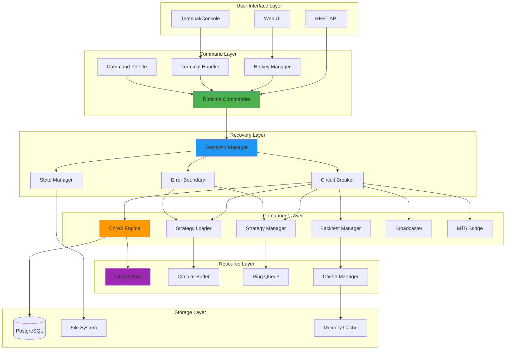

## Recovery Flow

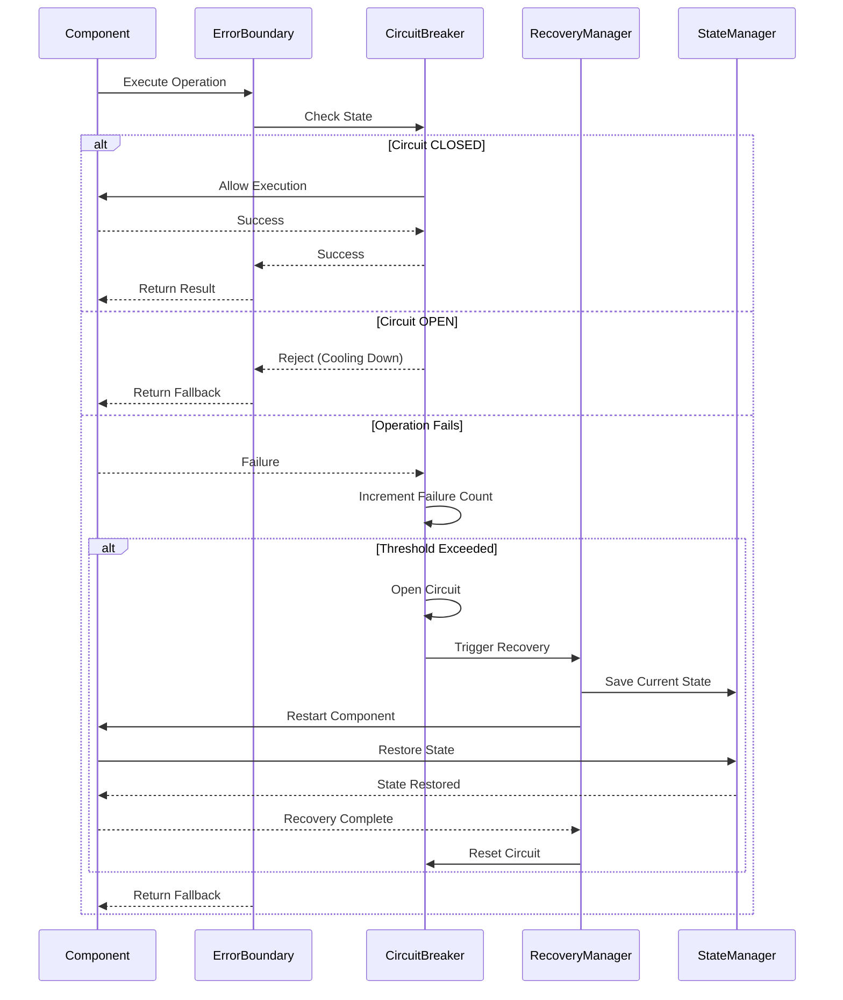

## Command Execution Flow

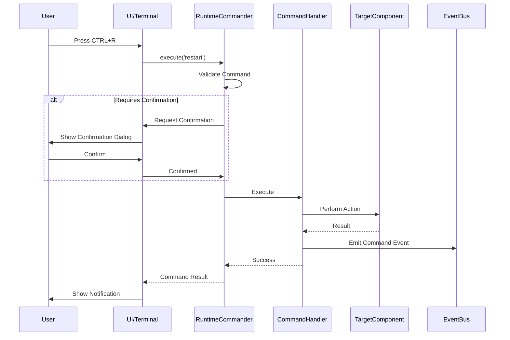

## Component Lifecycle with Recovery

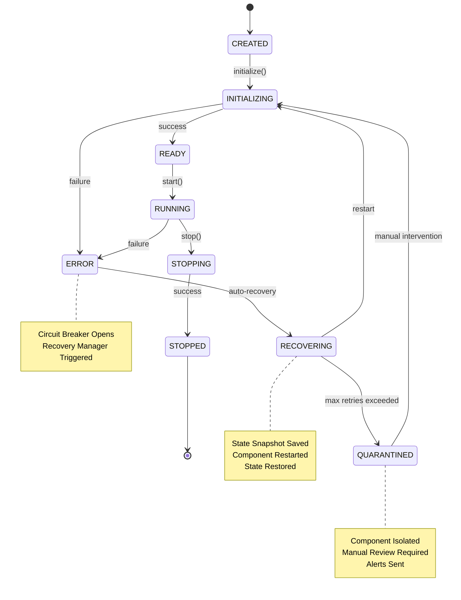

## Circuit Breaker State Machine

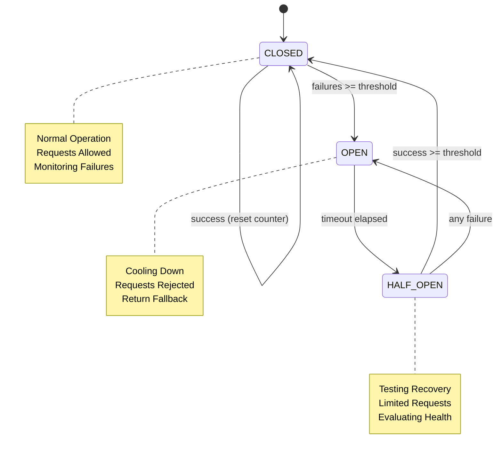

## Resource Pool Architecture

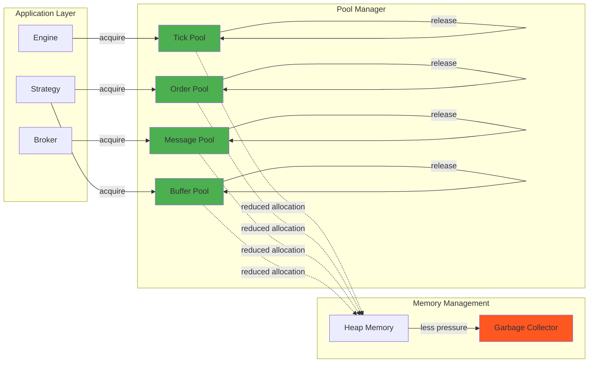

## Data Structure Comparison

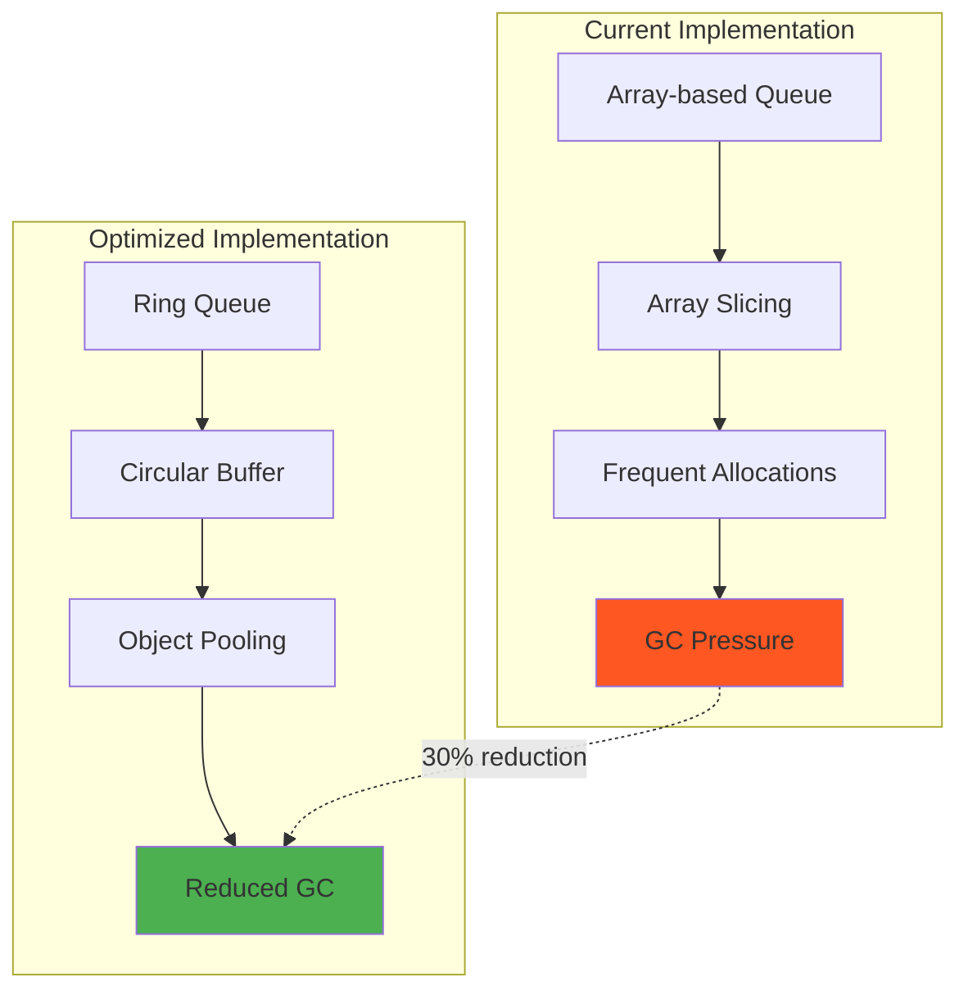

## Error Propagation & Isolation

```mermaid
graph TB
    subgraph "Strategy 1"
        S1[Strategy Instance]
        EB1[Error Boundary]
        S1 --> EB1
    end
    
    subgraph "Strategy 2"
        S2[Strategy Instance]
        EB2[Error Boundary]
        S2 --> EB2
    end
    
    subgraph "Strategy 3"
        S3[Strategy Instance]
        EB3[Error Boundary]
        S3 --> EB3
    end
    
    Engine[CoreX Engine]
    RM[Recovery Manager]
    
    EB1 --> Engine
    EB2 --> Engine
    EB3 --> Engine
    
    EB1 -.->|error isolated| RM
    EB2 --> Engine
    EB3 --> Engine
    
    S1 -.->|crashed| S1
    S2 --> S2
    S3 --> S3
    
    style S1 fill:#FF5722
    style EB1 fill:#FFC107
    style S2 fill:#4CAF50
    style S3 fill:#4CAF50
    
    note right of EB1
        Error Captured
        Strategy Isolated
        Engine Continues
    end note
```

## Cache Architecture

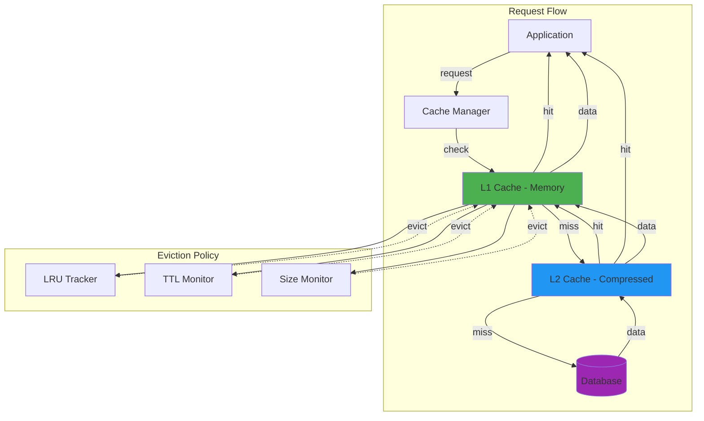

## Monitoring Dashboard Layout

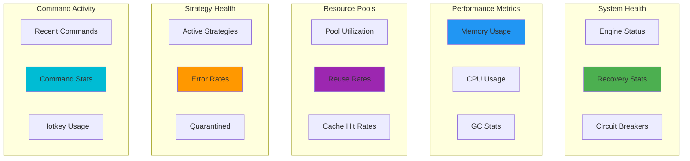

## Implementation Phases Timeline

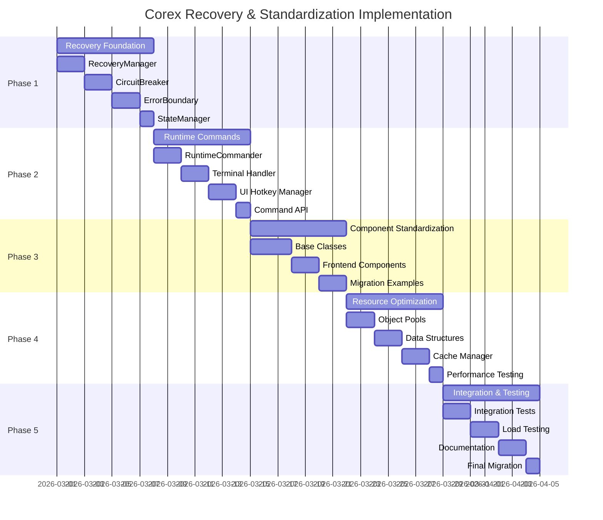

## Key Metrics Dashboard

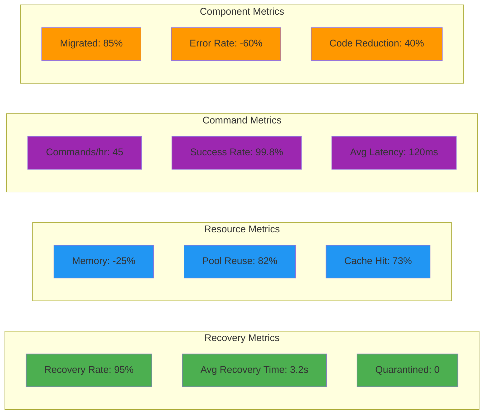
